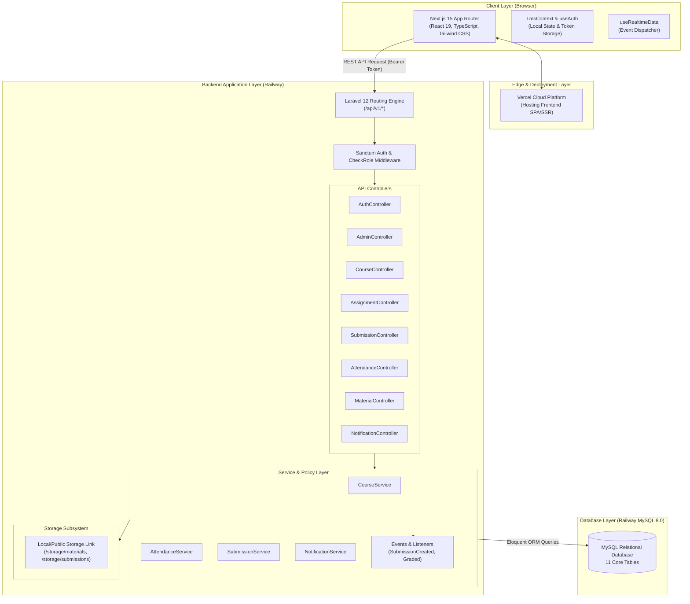
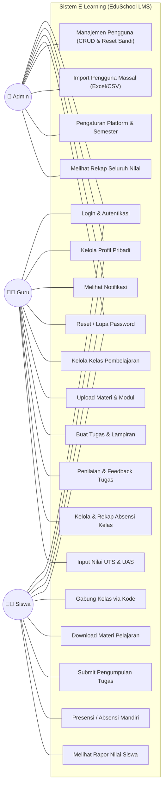
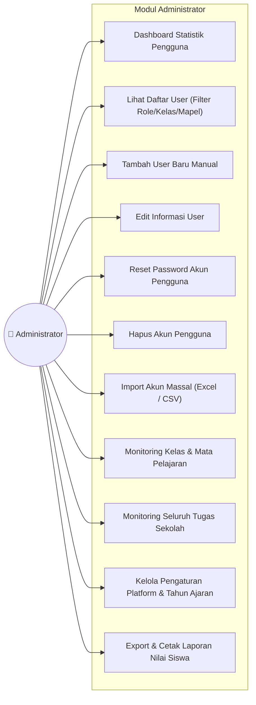
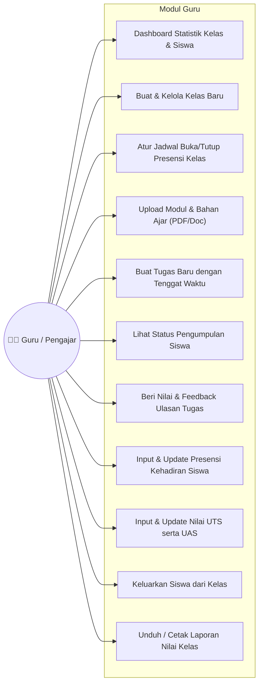
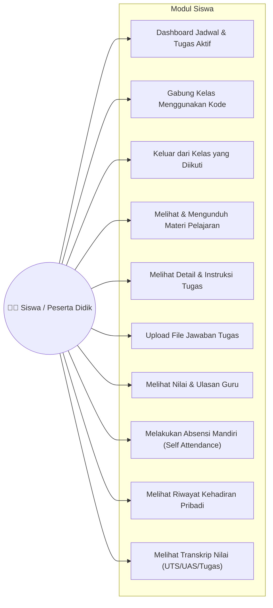
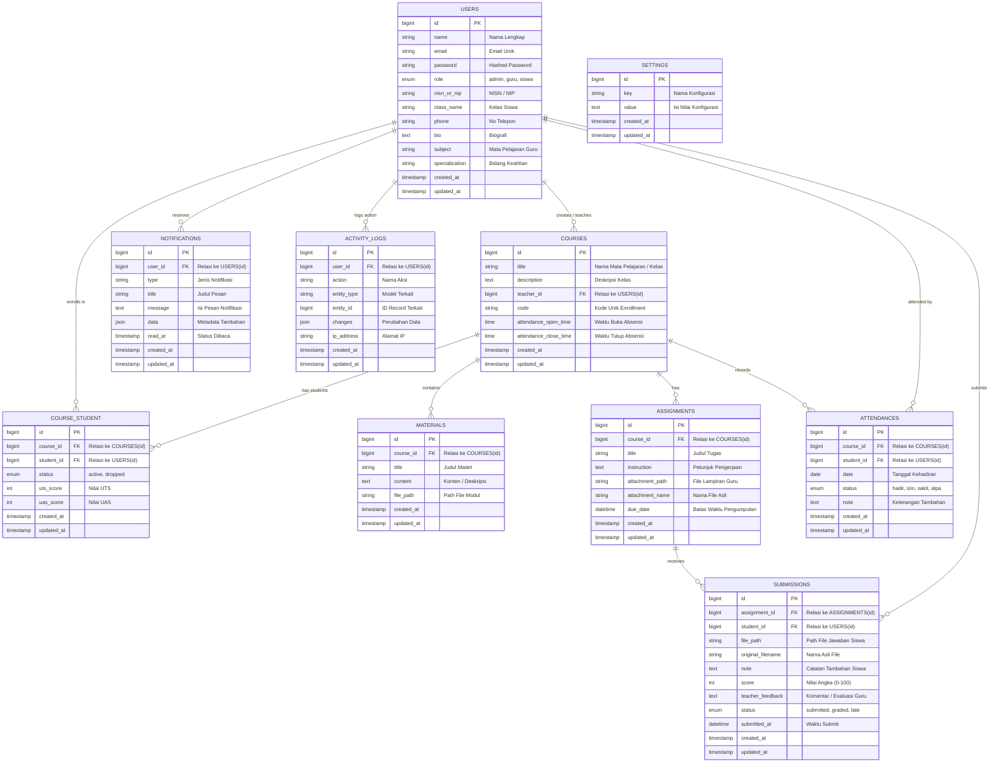
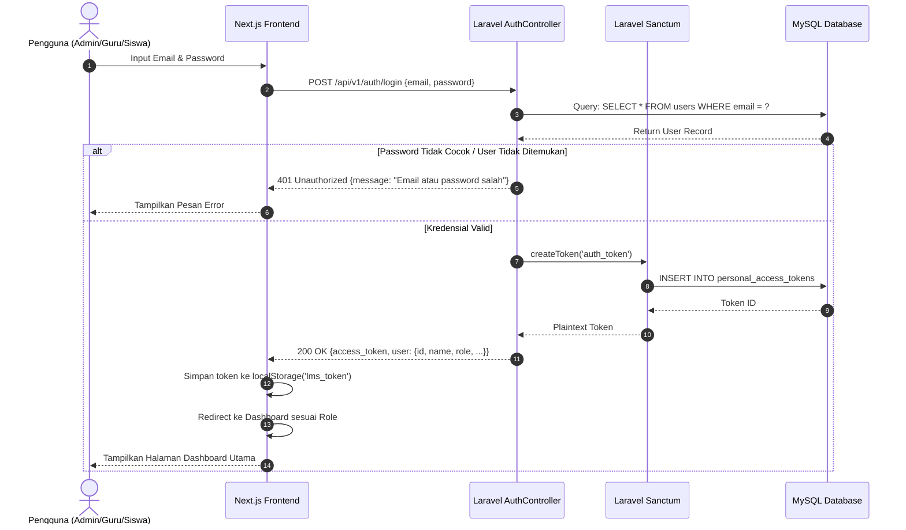
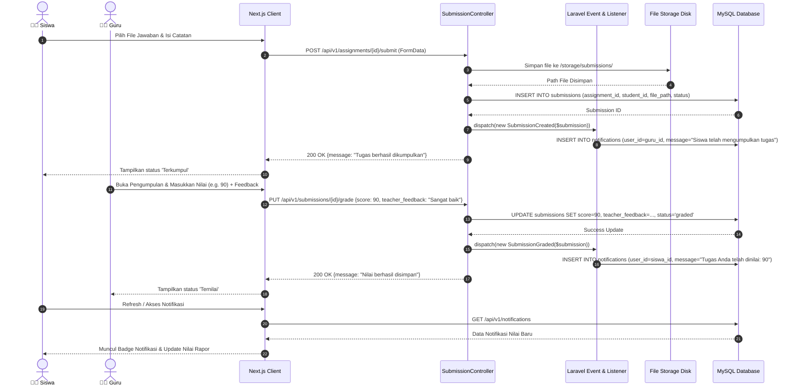
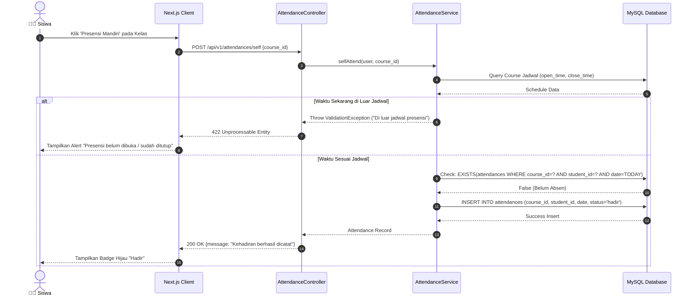

# 📊 Dokumentasi Diagram Sistem E-Learning (EduSchool LMS)

Dokumen ini berisi kumpulan diagram visual lengkap yang memodelkan arsitektur, usecase, database (ERD), flowchart alur sistem, dan sequence diagram untuk **Sistem E-Learning EduSchool**. Seluruh diagram dibuat menggunakan standar **Mermaid** sehingga dapat dirender langsung di GitHub, GitLab, VS Code, maupun tools markdown viewer lainnya.

---

## 📑 Daftar Isi Diagram

1. [Arsitektur Sistem (System Architecture)](#1-arsitektur-sistem-system-architecture)
2. [Use Case Diagram](#2-use-case-diagram)
   - [Use Case Diagram Global](#21-use-case-diagram-global)
   - [Use Case Detail Administrator](#22-use-case-detail-administrator)
   - [Use Case Detail Guru](#23-use-case-detail-guru)
   - [Use Case Detail Siswa](#24-use-case-detail-siswa)
3. [Entity Relationship Diagram (ERD)](#3-entity-relationship-diagram-erd)
4. [Flowchart Alur Sistem (Secara Keseluruhan)](#4-flowchart-alur-sistem-secara-keseluruhan)
5. [Sequence Diagram](#5-sequence-diagram)
   - [Sequence Autentikasi (Login Sanctum)](#51-sequence-autentikasi-login-sanctum)
   - [Sequence Submit Tugas & Grading Notifikasi](#52-sequence-submit-tugas--grading-notifikasi)
   - [Sequence Self-Attendance (Absen Mandiri)](#53-sequence-self-attendance-absen-mandiri)

---

## 1. Arsitektur Sistem (System Architecture)

---

## 2. Use Case Diagram

### 2.1 Use Case Diagram Global

---

### 2.2 Use Case Detail Administrator

---

### 2.3 Use Case Detail Guru

---

### 2.4 Use Case Detail Siswa

---

## 3. Entity Relationship Diagram (ERD)

---

## 4. Flowchart Alur Sistem (Secara Keseluruhan)

Diagram alir di bawah ini menyatukan seluruh proses dan interaksi sistem secara menyeluruh (*End-to-End*) dari awal hingga akhir, menggabungkan alur **Administrator**, **Guru**, **Siswa**, serta proses otomatis pada **Backend API & Database**:

```mermaid
flowchart TD
    %% ================= GLOBAL START =================
    StartSys([🏁 Mulai Operasional LMS]) --> InitPlatform

    %% ================= FASE 1: INISIALISASI & USER MANAGEMENT (ADMIN) =================
    subgraph AdminPhase [" 1. Fase Inisialisasi & Manajemen Pengguna (Admin) "]
        InitPlatform[Admin Mengatur Platform<br/>Tahun Ajaran & Semester]
        InitPlatform --> AddUsers[Kelola Akun Pengguna<br/>Tambah Manual / Bulk Import Excel]
        AddUsers --> DistributeAcc[Akun Siap Digunakan<br/>Email & Password Terdistribusi]
    end

    %% ================= FASE 2: AUTENTIKASI & ROLE ROUTING =================
    subgraph AuthPhase [" 2. Fase Autentikasi & Otorisasi Sistem "]
        DistributeAcc --> UserLogin[Pengguna Membuka Web & Login di /login]
        UserLogin --> AuthCheck{Kredensial Valid & Terdaftar di DB?}
        AuthCheck -- Tidak --> AuthFailed[Tolak Akses: Tampilkan Pesan Error]
        AuthFailed --> UserLogin
        AuthCheck -- Ya --> IssueToken[Generate Bearer Token Sanctum]
        IssueToken --> RoleRouting{Evaluasi user.role}
    end

    %% ================= FASE 3: KELAS & MATERI (GURU) =================
    subgraph GuruPhase [" 3. Fase Kegiatan Belajar Mengajar (Guru) "]
        RoleRouting -- 'guru' --> GuruDashboard[Masuk Dashboard Guru]
        GuruDashboard --> CreateCourse[Buat Kelas / Mata Pelajaran Baru]
        CreateCourse --> GenCourseCode[Sistem Generate Kode Kelas Unik]
        GenCourseCode --> SetSchedule[Atur Jadwal Buka/Tutup Presensi]
        SetSchedule --> UploadMaterials[Upload Modul Materi PDF/Doc]
        UploadMaterials --> CreateTasks[Buat Tugas Baru & Tentukan Deadline]
    end

    %% ================= FASE 4: PARTISIPASI BELAJAR (SISWA) =================
    subgraph SiswaPhase [" 4. Fase Partisipasi, Presensi & Pengerjaan (Siswa) "]
        RoleRouting -- 'siswa' --> SiswaDashboard[Masuk Dashboard Siswa]
        SiswaDashboard --> JoinCourse[Gabung Kelas via Input Kode Kelas]
        JoinCourse --> AccessMaterials[Akses Kelas & Unduh Materi Belajar]
        
        %% Presensi Mandiri
        AccessMaterials --> SelfAttendance[Presensi Mandiri / Kehadiran Siswa]
        SelfAttendance --> TimeCheck{Sesuai Jam Buka & Tutup Presensi?}
        TimeCheck -- Tidak --> AttBlocked[Presensi Ditolak: Di luar waktu]
        TimeCheck -- Ya --> AttSuccess[Presensi Tercatat: Status 'Hadir']
        
        %% Pengerjaan Tugas
        AttSuccess --> ReadAssignment[Buka & Baca Instruksi Tugas]
        ReadAssignment --> DoTask[Mengerjakan Tugas & Buat File Jawaban]
        DoTask --> UploadSubmission[Upload File Jawaban ke Sistem]
        UploadSubmission --> DeadlineCheck{Submit Sebelum Batas Waktu?}
        DeadlineCheck -- Ya --> StatusSubmitted[Status: 'submitted']
        DeadlineCheck -- Tidak --> StatusLate[Status: 'late']
    end

    %% ================= FASE 5: PENILAIAN & EVALUASI =================
    subgraph GradingPhase [" 5. Fase Penilaian & Rekap Nilai Rapor "]
        StatusSubmitted --> TriggerNotif[Sistem Trigger Notifikasi Otomatis ke Guru]
        StatusLate --> TriggerNotif
        TriggerNotif --> GuruReviewSub[Guru Memeriksa Jawaban Siswa]
        GuruReviewSub --> InputAssignmentGrade[Guru Input Nilai Tugas 0-100 & Feedback]
        InputAssignmentGrade --> InputExamGrades[Guru Input Nilai UTS & UAS Siswa]
        
        InputExamGrades --> SyncReport[Database Menghitung Rekap Nilai Rapor]
        SyncReport --> StudentViewGrades[Siswa Melihat Rapor & Notifikasi Nilai]
    end

    %% ================= FASE 6: MONITORING & LAPORAN (ADMIN) =================
    subgraph ReportPhase [" 6. Fase Monitoring & Pelaporan Sekolah (Admin) "]
        RoleRouting -- 'admin' --> AdminDashboard[Masuk Dashboard Admin]
        AdminDashboard --> MonitorActivities[Pantau Statistik Pengguna, Kelas, & Kehadiran]
        SyncReport -.-> MonitorActivities
        MonitorActivities --> ExportReports[Export Rekapitulasi Rapor Siswa]
        ExportReports --> EndSys([🏆 Selesai / Arsip Semester])
        StudentViewGrades --> EndSys
    end

    %% ================= STYLING =================
    classDef adminStyle fill:#EEF2FF,stroke:#4F46E5,stroke-width:2px;
    classDef guruStyle fill:#F0FDF4,stroke:#16A34A,stroke-width:2px;
    classDef siswaStyle fill:#FEF3C7,stroke:#D97706,stroke-width:2px;
    classDef sysStyle fill:#F1F5F9,stroke:#475569,stroke-width:2px;

    class InitPlatform,AddUsers,DistributeAcc,AdminDashboard,MonitorActivities,ExportReports adminStyle;
    class GuruDashboard,CreateCourse,GenCourseCode,SetSchedule,UploadMaterials,CreateTasks,GuruReviewSub,InputAssignmentGrade,InputExamGrades guruStyle;
    class SiswaDashboard,JoinCourse,AccessMaterials,SelfAttendance,AttSuccess,ReadAssignment,DoTask,UploadSubmission,StatusSubmitted,StatusLate,StudentViewGrades siswaStyle;
    class UserLogin,AuthCheck,IssueToken,RoleRouting,TimeCheck,DeadlineCheck,TriggerNotif,SyncReport sysStyle;
```

---

## 5. Sequence Diagram

### 5.1 Sequence Autentikasi (Login Sanctum)

---

### 5.2 Sequence Submit Tugas & Grading Notifikasi

---

### 5.3 Sequence Self-Attendance (Absen Mandiri)

---

*Dokumentasi Diagram ini disusun untuk melengkapi pelaporan teknis, skripsi/tugas akhir, dan pemahaman arsitektur sistem E-Learning.*
