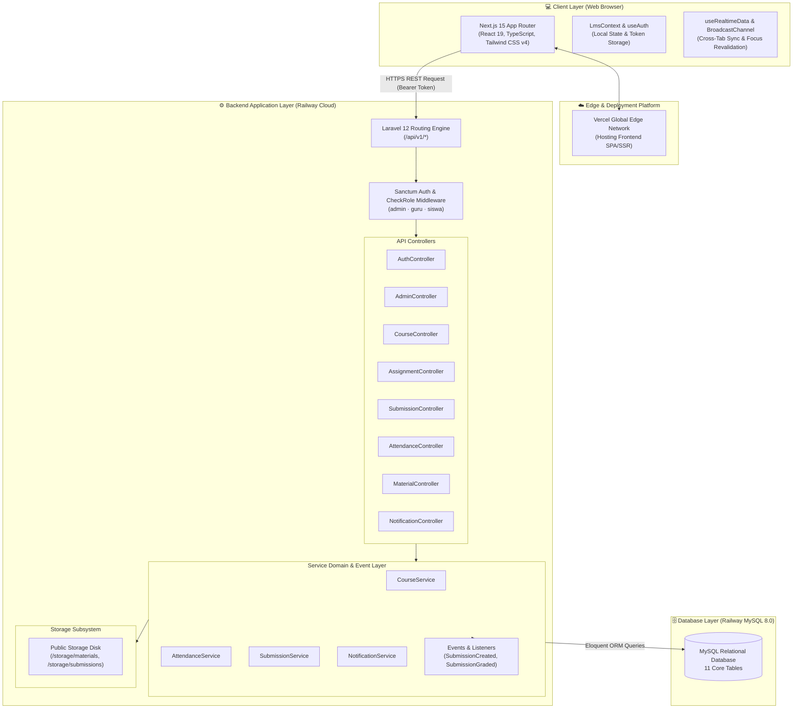
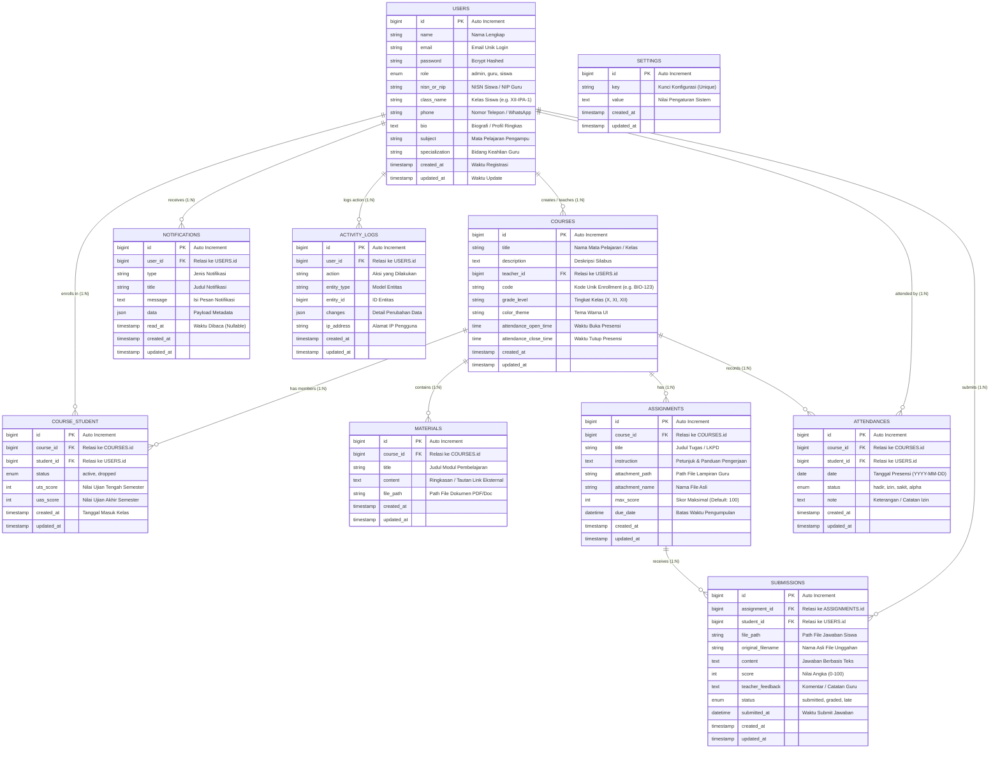
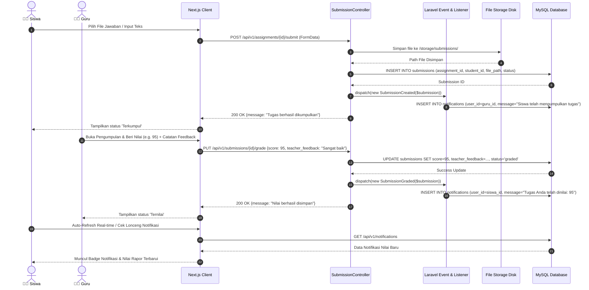

# 📊 Dokumentasi Diagram Sistem E-Learning (EduSchool LMS)

Dokumen ini berisi kumpulan diagram visual lengkap yang memodelkan arsitektur, use case terpadu (*unified use case*), relasi database (*unified ERD*), flowchart alur sistem terpadu (*unified end-to-end flowchart*), dan sequence diagram untuk **Sistem E-Learning EduSchool LMS**.

Seluruh diagram dibuat menggunakan standar **Mermaid** sehingga dapat dirender langsung di GitHub, GitLab, VS Code, maupun tools markdown viewer lainnya.

---

## 📑 Daftar Isi Diagram

1. [Diagram Arsitektur Sistem Terpadu (System Architecture)](#1-diagram-arsitektur-sistem-terpadu-system-architecture)
2. [Diagram Use Case Lengkap Terpadu (Unified Master Use Case Diagram)](#2-diagram-use-case-lengkap-terpadu-unified-master-use-case-diagram)
3. [Diagram Relasi Database Terpadu (Unified Entity Relationship Diagram - ERD)](#3-diagram-relasi-database-terpadu-unified-entity-relationship-diagram---erd)
4. [Diagram Alir Sistem Terpadu (Unified End-to-End System Flowchart)](#4-diagram-alir-sistem-terpadu-unified-end-to-end-system-flowchart)
5. [Diagram Sekuensial (Sequence Diagrams)](#5-diagram-sekuensial-sequence-diagrams)
   - [5.1 Sequence Autentikasi (Login Sanctum)](#51-sequence-autentikasi-login-sanctum)
   - [5.2 Sequence Submit Tugas & Grading Notifikasi](#52-sequence-submit-tugas--grading-notifikasi)
   - [5.3 Sequence Self-Attendance (Presensi Mandiri)](#53-sequence-self-attendance-presensi-mandiri)

---

## 1. Diagram Arsitektur Sistem Terpadu (System Architecture)

---

## 2. Diagram Use Case Lengkap Terpadu (Unified Master Use Case Diagram)

Diagram Use Case di bawah ini menyatukan seluruh aktor (**Administrator**, **Guru Pengajar**, dan **Peserta Didik / Siswa**) beserta seluruh fungsionalitas sistem ke dalam **satu diagram utuh terpadu**:

```mermaid
flowchart LR
    %% Actors
    Admin((👤 Administrator))
    Guru((👨‍🏫 Guru Pengajar))
    Siswa((👨‍🎓 Peserta Didik))

    subgraph SystemBoundary [" 🏫 Sistem E-Learning EduSchool LMS (Unified System Boundary) "]
        
        %% ================= SHARED CORE USE CASES =================
        subgraph CoreModule [" 🔐 Modul Inti Bersama (Shared Core) "]
            UC_Login(["1. Login & Autentikasi Akun"])
            UC_Forgot(["2. Lupa / Reset Password"])
            UC_Profile(["3. Kelola Profil Pribadi"])
            UC_Notif(["4. Notifikasi Lonceng Real-time"])
        end

        %% ================= ADMIN USE CASES =================
        subgraph AdminModule [" 🛡️ Modul Administrator "]
            UC_AdmDashboard(["5. Dashboard Statistik Global"])
            UC_ManageUser(["6. Manajemen Pengguna (CRUD)"])
            UC_ResetPassUser(["7. Reset Sandi Pengguna Lain"])
            UC_BulkImport(["8. Bulk Import Akun (Excel/CSV)"])
            UC_MonitorCourse(["9. Monitoring Kelas & Mapel"])
            UC_Settings(["10. Pengaturan Sekolah & Semester"])
            UC_ExportReports(["11. Rekapitulasi & Ekspor Laporan"])
        end

        %% ================= GURU USE CASES =================
        subgraph GuruModule [" 📚 Modul Guru Pengajar "]
            UC_GuruDashboard(["12. Dashboard Guru & Metrik Kelas"])
            UC_ManageCourse(["13. Buat & Kelola Kelas Mapel"])
            UC_SetAttendanceSched(["14. Atur Jam Buka-Tutup Presensi"])
            UC_UploadMaterial(["15. Unggah Materi (Doc/PDF/Link)"])
            UC_CreateTask(["16. Terbitkan Tugas & LKPD"])
            UC_ReviewSubmissions(["17. Periksa Pengumpulan Siswa"])
            UC_GradeTask(["18. Beri Nilai & Feedback Ulasan"])
            UC_InputExams(["19. Input Nilai UTS & UAS"])
            UC_ManageClassAttendance(["20. Rekap Presensi Kelas"])
            UC_KickStudent(["21. Keluarkan Siswa dari Kelas"])
        end

        %% ================= SISWA USE CASES =================
        subgraph SiswaModule [" 🎒 Modul Peserta Didik (Siswa) "]
            UC_SiswaDashboard(["22. Dashboard Jadwal & Tugas Aktif"])
            UC_JoinCourse(["23. Gabung Kelas via Kode / Katalog"])
            UC_LeaveCourse(["24. Keluar dari Kelas"])
            UC_ReadMaterial(["25. Akses & Baca Modul Ajar"])
            UC_SelfAttend(["26. Presensi Mandiri Hari Ini"])
            UC_ViewAttHistory(["27. Cek Riwayat Kehadiran"])
            UC_SubmitTask(["28. Kumpul Jawaban / Unggah File"])
            UC_ViewGrades(["29. Rapor Nilai Siswa (Tugas/UTS/UAS)"])
        end

    end

    %% ================= ACTOR CONNECTIONS =================
    %% Shared Core Connections
    Admin --- UC_Login
    Guru --- UC_Login
    Siswa --- UC_Login

    Admin --- UC_Forgot
    Guru --- UC_Forgot
    Siswa --- UC_Forgot

    Admin --- UC_Profile
    Guru --- UC_Profile
    Siswa --- UC_Profile

    Admin --- UC_Notif
    Guru --- UC_Notif
    Siswa --- UC_Notif

    %% Admin Connections
    Admin --- UC_AdmDashboard
    Admin --- UC_ManageUser
    Admin --- UC_ResetPassUser
    Admin --- UC_BulkImport
    Admin --- UC_MonitorCourse
    Admin --- UC_Settings
    Admin --- UC_ExportReports

    %% Guru Connections
    Guru --- UC_GuruDashboard
    Guru --- UC_ManageCourse
    Guru --- UC_SetAttendanceSched
    Guru --- UC_UploadMaterial
    Guru --- UC_CreateTask
    Guru --- UC_ReviewSubmissions
    Guru --- UC_GradeTask
    Guru --- UC_InputExams
    Guru --- UC_ManageClassAttendance
    Guru --- UC_KickStudent

    %% Siswa Connections
    Siswa --- UC_SiswaDashboard
    Siswa --- UC_JoinCourse
    Siswa --- UC_LeaveCourse
    Siswa --- UC_ReadMaterial
    Siswa --- UC_SelfAttend
    Siswa --- UC_ViewAttHistory
    Siswa --- UC_SubmitTask
    Siswa --- UC_ViewGrades

    %% Styling
    classDef actorStyle fill:#1E293B,stroke:#0F172A,stroke-width:2px,color:#FFFFFF;
    classDef coreStyle fill:#EFF6FF,stroke:#3B82F6,stroke-width:1.5px;
    classDef adminStyle fill:#F5F3FF,stroke:#7C3AED,stroke-width:1.5px;
    classDef guruStyle fill:#F0FDF4,stroke:#16A34A,stroke-width:1.5px;
    classDef siswaStyle fill:#FFFBEB,stroke:#D97706,stroke-width:1.5px;

    class Admin,Guru,Siswa actorStyle;
    class UC_Login,UC_Forgot,UC_Profile,UC_Notif coreStyle;
    class UC_AdmDashboard,UC_ManageUser,UC_ResetPassUser,UC_BulkImport,UC_MonitorCourse,UC_Settings,UC_ExportReports adminStyle;
    class UC_GuruDashboard,UC_ManageCourse,UC_SetAttendanceSched,UC_UploadMaterial,UC_CreateTask,UC_ReviewSubmissions,UC_GradeTask,UC_InputExams,UC_ManageClassAttendance,UC_KickStudent guruStyle;
    class UC_SiswaDashboard,UC_JoinCourse,UC_LeaveCourse,UC_ReadMaterial,UC_SelfAttend,UC_ViewAttHistory,UC_SubmitTask,UC_ViewGrades siswaStyle;
```

---

## 3. Diagram Relasi Database Terpadu (Unified Entity Relationship Diagram - ERD)

Diagram ERD terpadu ini memodelkan seluruh **11 tabel basis data MySQL 8.0**, lengkap dengan atribut, *Primary Key (PK)*, *Foreign Key (FK)*, tipe data, serta kardinalitas relasi antar entitas:

---

## 4. Diagram Alir Sistem Terpadu (Unified End-to-End System Flowchart)

Diagram alir terpadu ini menyajikan seluruh proses operasional pembelajaran digital secara *End-to-End* dalam satu diagram terintegrasi:

```mermaid
flowchart TD
    %% ================= START =================
    StartSys(["🏁 Mulai Operasional E-Learning"]) --> InitPlatform

    %% ================= 1. ADMIN INITIALIZATION =================
    subgraph AdminPhase [" 1. Fase Inisialisasi & Tata Kelola Pengguna (Administrator) "]
        InitPlatform["Admin Mengatur Identitas Sekolah<br/>Tahun Ajaran & Semester Aktif"]
        InitPlatform --> AddUsers["Kelola Akun Pengguna<br/>Tambah Manual / Bulk Import Excel 50+ User"]
        AddUsers --> DistributeAcc["Akun Siap Digunakan<br/>Email & Password Terdistribusi ke Guru & Siswa"]
    end

    %% ================= 2. AUTHENTICATION & ROLE ROUTING =================
    subgraph AuthPhase [" 2. Fase Autentikasi & Otorisasi Sesi "]
        DistributeAcc --> UserLogin["Pengguna Membuka Web LMS & Login di /login"]
        UserLogin --> AuthCheck{"Kredensial Valid & Terdaftar di DB?"}
        AuthCheck -- "Tidak Valid" --> AuthFailed["Tolak Akses: Tampilkan Notifikasi Error"]
        AuthFailed --> UserLogin
        AuthCheck -- "Valid" --> IssueToken["Generate Bearer Token Sanctum<br/>Simpan ke LocalStorage"]
        IssueToken --> RoleRouting{"Evaluasi user.role"}
    end

    %% ================= 3. GURU CLASS & LESSON CREATION =================
    subgraph GuruPhase [" 3. Fase Pengelolaan Kelas & Materi (Guru) "]
        RoleRouting -- "guru" --> GuruDashboard["Buka Dashboard Guru"]
        GuruDashboard --> CreateCourse["Buat Kelas / Mata Pelajaran Baru"]
        CreateCourse --> GenCourseCode["Sistem Terbitkan Kode Kelas Unik"]
        GenCourseCode --> SetSchedule["Atur Jam Buka-Tutup Presensi Kelas"]
        SetSchedule --> UploadMaterials["Unggah Modul Bahan Ajar PDF/Doc/Link"]
        UploadMaterials --> CreateTasks["Terbitkan Tugas / LKPD Baru & Tentukan Deadline"]
    end

    %% ================= 4. SISWA LEARNING & PARTICIPATION =================
    subgraph SiswaPhase [" 4. Fase Pembelajaran, Presensi & Pengerjaan (Siswa) "]
        RoleRouting -- "siswa" --> SiswaDashboard["Buka Dashboard Siswa"]
        SiswaDashboard --> JoinCourse["Gabung Kelas via Input Kode Unik / Katalog"]
        JoinCourse --> AccessMaterials["Buka Kelas & Pelajari Modul Bahan Ajar"]
        
        %% Presensi Mandiri
        AccessMaterials --> SelfAttendance["Lakukan Presensi / Absensi Mandiri"]
        SelfAttendance --> TimeCheck{"Waktu Sekarang Masuk Jam Presensi?"}
        TimeCheck -- "Di Luar Waktu" --> AttBlocked["Presensi Ditolak: Belum Dibuka / Sudah Lewat"]
        TimeCheck -- "Sesuai Waktu" --> AttSuccess["Presensi Disimpan: Status 'Hadir'"]
        
        %% Pengerjaan Tugas
        AttSuccess --> ReadAssignment["Buka & Baca Instruksi Tugas"]
        ReadAssignment --> DoTask["Mengerjakan Tugas & Menyiapkan Lembar Jawaban"]
        DoTask --> UploadSubmission["Kirimkan Tugas (Submit Teks / File)"]
        UploadSubmission --> DeadlineCheck{"Waktu Submit Sebelum Deadline?"}
        DeadlineCheck -- "Tepat Waktu" --> StatusSubmitted["Status Disimpan: 'submitted'"]
        DeadlineCheck -- "Terlambat" --> StatusLate["Status Disimpan: 'late'"]
    end

    %% ================= 5. GRADING & EXAMS =================
    subgraph GradingPhase [" 5. Fase Penilaian & Input Nilai Semester (Guru) "]
        StatusSubmitted --> TriggerNotif["Sistem Kirim Notifikasi Real-time ke Guru"]
        StatusLate --> TriggerNotif
        TriggerNotif --> GuruReviewSub["Guru Memeriksa Berkas Jawaban Siswa"]
        GuruReviewSub --> InputAssignmentGrade["Guru Input Nilai Tugas 0-100 & Catatan Feedback"]
        InputAssignmentGrade --> InputExamGrades["Guru Input Nilai Ujian Semester UTS & UAS"]
        
        InputExamGrades --> SyncReport["Database Menghitung Rekap Nilai Rapor & Persentase Presensi"]
        SyncReport --> StudentViewGrades["Siswa Melihat Rapor Nilai & Ulasan Guru"]
    end

    %% ================= 6. MONITORING & REPORT EXPORT =================
    subgraph ReportPhase [" 6. Fase Monitoring & Pelaporan Sekolah (Administrator) "]
        RoleRouting -- "admin" --> AdminDashboard["Buka Dashboard Administrator"]
        AdminDashboard --> MonitorActivities["Pantau Statistik Global: Kelas, User, & Presensi"]
        SyncReport --> MonitorActivities
        MonitorActivities --> ExportReports["Ekspor Rekapitulasi Rapor Siswa ke Excel (.xlsx) / CSV"]
        ExportReports --> EndSys(["🏆 Selesai / Arsip Periode Semester"])
        StudentViewGrades --> EndSys
    end

    %% ================= STYLING =================
    classDef adminStyle fill:#EEF2FF,stroke:#4F46E5,stroke-width:2px;
    classDef guruStyle fill:#F0FDF4,stroke:#16A34A,stroke-width:2px;
    classDef siswaStyle fill:#FEF3C7,stroke:#D97706,stroke-width:2px;
    classDef sysStyle fill:#F1F5F9,stroke:#475569,stroke-width:2px;

    class InitPlatform,AddUsers,DistributeAcc,AdminDashboard,MonitorActivities,ExportReports adminStyle;
    class GuruDashboard,CreateCourse,GenCourseCode,SetSchedule,UploadMaterials,CreateTasks,GuruReviewSub,InputAssignmentGrade,InputExamGrades guruStyle;
    class SiswaDashboard,JoinCourse,AccessMaterials,SelfAttendance,AttSuccess,ReadAssignment,DoTask,UploadSubmission,StatusSubmitted,StatusLate,StudentViewGrades siswaStyle;
    class UserLogin,AuthCheck,IssueToken,RoleRouting,TimeCheck,DeadlineCheck,TriggerNotif,SyncReport sysStyle;
```

---

## 5. Diagram Sekuensial (Sequence Diagrams)

### 5.1 Sequence Autentikasi (Login Sanctum)

---

### 5.2 Sequence Submit Tugas & Grading Notifikasi

---

### 5.3 Sequence Self-Attendance (Presensi Mandiri)

---

*Dokumentasi Diagram Lengkap Terpadu ini disusun untuk melengkapi pelaporan teknis, skripsi/tugas akhir, dan pemahaman arsitektur sistem E-Learning.*
