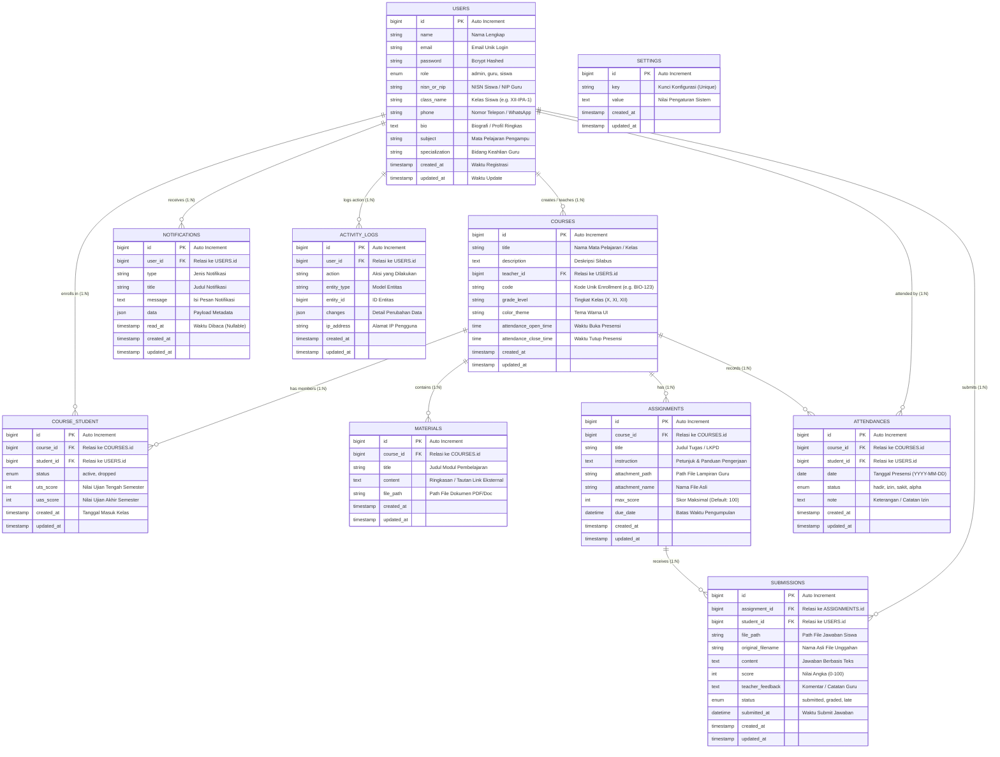

# 📊 Dokumentasi Diagram Sistem E-Learning (EduSchool LMS)

Dokumen ini berisi **3 Diagram Utama Terpadu** yang memodelkan fungsionalitas use case, struktur relasi database (ERD), dan alur operasional sistem (Flowchart) untuk **Sistem E-Learning EduSchool LMS**.

---

## 📑 Daftar Isi Diagram Utama

1. [Diagram Use Case Terpadu (Unified Use Case Diagram)](#1-diagram-use-case-terpadu-unified-use-case-diagram)
2. [Diagram Relasi Database Terpadu (Unified Entity Relationship Diagram - ERD)](#2-diagram-relasi-database-terpadu-unified-entity-relationship-diagram---erd)
3. [Diagram Alir Sistem Terpadu (Unified End-to-End System Flowchart)](#3-diagram-alir-sistem-terpadu-unified-end-to-end-system-flowchart)

---

## 1. Diagram Use Case Terpadu (Unified Use Case Diagram)

Diagram Use Case ini menyatukan seluruh aktor (**Administrator**, **Guru Pengajar**, dan **Peserta Didik / Siswa**) ke dalam satu batasan sistem terpadu yang mencakup seluruh modul fungsional:

```mermaid
flowchart TD
    %% ================= 1. TOP SHARED CORE MODULE =================
    subgraph CoreBox [" 🔐 FITUR INTI BERSAMA (SEMUA AKUN / SHARED CORE) "]
        direction LR
        UC_Login(["🔑 Login & Autentikasi (Sanctum)"])
        UC_Forgot(["🔄 Reset Password Mandiri"])
        UC_Profile(["👤 Kelola Profil Pribadi & WhatsApp"])
        UC_Notif(["🔔 Lonceng Notifikasi Real-time"])
        UC_Logout(["🚪 Logout / Keluar Sesi"])
    end

    %% ================= 2. THREE ROLE COLUMNS =================
    CoreBox -.-> AdminActor
    CoreBox -.-> GuruActor
    CoreBox -.-> SiswaActor

    %% ================= COLUMN 1: ADMIN =================
    subgraph AdminCol [" 👑 ROLE ADMINISTRATOR (SUPER USER) "]
        direction TB
        AdminActor((👤 Administrator))
        
        AdminActor --> UC_AdmDashboard(["📊 Dashboard Statistik Global LMS"])
        UC_AdmDashboard --> UC_ListUsers(["👥 Kelola Data Pengguna (CRUD)"])
        UC_ListUsers --> UC_ResetPassUser(["🔑 Reset Password Akun User Lain"])
        UC_ResetPassUser --> UC_BulkImport(["📥 Bulk Import Akun (Excel/CSV 50+ User)"])
        UC_BulkImport --> UC_MonitorCourse(["📚 Monitoring Seluruh Kelas Mapel"])
        UC_MonitorCourse --> UC_MonitorAssign(["📝 Monitoring Tugas & LKPD Sekolah"])
        UC_MonitorAssign --> UC_Settings(["⚙️ Konfigurasi Identitas Sekolah"])
        UC_Settings --> UC_ExportReports(["📑 Rekap & Ekspor Laporan Excel/CSV"])
    end

    %% ================= COLUMN 2: GURU =================
    subgraph GuruCol [" 👨‍🏫 ROLE GURU PENGAJAR (TENAGA PENDIDIK) "]
        direction TB
        GuruActor((👨‍🏫 Guru Pengajar))
        
        GuruActor --> UC_GuruDashboard(["📊 Dashboard Guru & Ringkasan Siswa"])
        UC_GuruDashboard --> UC_CreateCourse(["➕ Buat Kelas Mapel & Terbitkan Kode"])
        UC_CreateCourse --> UC_ManageStudents(["👥 Kelola Siswa Terdaftar di Kelas"])
        UC_ManageStudents --> UC_KickStudent(["🚫 Keluarkan (Kick) Siswa dari Kelas"])
        UC_KickStudent --> UC_SetAttendanceSched(["⏰ Atur Jam Buka-Tutup Presensi"])
        UC_SetAttendanceSched --> UC_UploadMaterial(["📄 Upload Modul Bahan Ajar (PDF/Link)"])
        UC_UploadMaterial --> UC_CreateTask(["📝 Terbitkan Tugas/LKPD, File & Deadline"])
        UC_CreateTask --> UC_ReviewSubmissions(["📥 Periksa Berkas Lembar Jawaban"])
        UC_ReviewSubmissions --> UC_GradeTask(["⭐ Beri Nilai Tugas (0-100) & Feedback"])
        UC_GradeTask --> UC_InputExams(["🏆 Input Nilai Ujian Semester (UTS & UAS)"])
        UC_InputExams --> UC_ManageClassAttendance(["📋 Rekap Presensi Harian (H/I/S/A)"])
        UC_ManageClassAttendance --> UC_ExportClassReport(["🖨️ Cetak & Unduh Rapor Nilai Kelas"])
    end

    %% ================= COLUMN 3: SISWA =================
    subgraph SiswaCol [" 👨‍🎓 ROLE PESERTA DIDIK (SISWA PEMBELAJAR) "]
        direction TB
        SiswaActor((👨‍🎓 Peserta Didik))
        
        SiswaActor --> UC_SiswaDashboard(["📊 Dashboard Siswa, Jadwal & Tugas"])
        UC_SiswaDashboard --> UC_BrowseCourses(["🔍 Jelajahi Katalog Kelas Terbuka"])
        UC_BrowseCourses --> UC_JoinCourseCode(["🔑 Gabung Kelas via Input Kode Unik"])
        UC_JoinCourseCode --> UC_LeaveCourse(["🚪 Keluar (Leave) dari Kelas"])
        UC_LeaveCourse --> UC_ReadMaterial(["📖 Akses & Unduh Modul Bahan Ajar"])
        UC_ReadMaterial --> UC_SelfAttend(["✅ Presensi / Absensi Mandiri Hari Ini"])
        UC_SelfAttend --> UC_ViewAttHistory(["📅 Cek Riwayat Kehadiran (H/I/S/A)"])
        UC_ViewAttHistory --> UC_ViewTaskList(["📝 Lihat Daftar Tugas & Batas Deadline"])
        UC_ViewTaskList --> UC_SubmitTask(["📤 Kumpulkan Tugas (Upload / Teks)"])
        UC_SubmitTask --> UC_ReceiveGradeNotif(["🔔 Terima Notifikasi Nilai dari Guru"])
        UC_ReceiveGradeNotif --> UC_ViewGrades(["📊 Lihat Transkrip Rapor Nilai Siswa"])
    end

    %% ================= STYLING (IDENTICAL TO FLOWCHART) =================
    classDef actorStyle fill:#0F172A,stroke:#0284C7,stroke-width:2px,color:#FFFFFF;
    classDef coreStyle fill:#EFF6FF,stroke:#3B82F6,stroke-width:1.5px,color:#1E3A8A;
    classDef adminStyle fill:#F5F3FF,stroke:#7C3AED,stroke-width:1.5px,color:#5B21B6;
    classDef guruStyle fill:#F0FDF4,stroke:#16A34A,stroke-width:1.5px,color:#166534;
    classDef siswaStyle fill:#FFFBEB,stroke:#D97706,stroke-width:1.5px,color:#92400E;

    class AdminActor,GuruActor,SiswaActor actorStyle;
    class UC_Login,UC_Forgot,UC_Profile,UC_Notif,UC_Logout coreStyle;
    class UC_AdmDashboard,UC_ListUsers,UC_ResetPassUser,UC_BulkImport,UC_MonitorCourse,UC_MonitorAssign,UC_Settings,UC_ExportReports adminStyle;
    class UC_GuruDashboard,UC_CreateCourse,UC_ManageStudents,UC_KickStudent,UC_SetAttendanceSched,UC_UploadMaterial,UC_CreateTask,UC_ReviewSubmissions,UC_GradeTask,UC_InputExams,UC_ManageClassAttendance,UC_ExportClassReport guruStyle;
    class UC_SiswaDashboard,UC_BrowseCourses,UC_JoinCourseCode,UC_LeaveCourse,UC_ReadMaterial,UC_SelfAttend,UC_ViewAttHistory,UC_ViewTaskList,UC_SubmitTask,UC_ReceiveGradeNotif,UC_ViewGrades siswaStyle;
```

---

## 2. Diagram Relasi Database Terpadu (Unified Entity Relationship Diagram - ERD)

Diagram ERD terpadu ini memodelkan seluruh **11 tabel basis data MySQL 8.0**, lengkap dengan atribut, *Primary Key (PK)*, *Foreign Key (FK)*, tipe data, serta kardinalitas relasi:

---

## 3. Diagram Alir Sistem Terpadu (Unified End-to-End System Flowchart)

Diagram alir terpadu ini menyajikan seluruh proses operasional pembelajaran digital secara *End-to-End* dalam satu alur komprehensif:

```mermaid
flowchart TD
    %% ================= 1. START & LOGIN =================
    StartNode(["🏁 Mulai (Buka Website LMS)"]) --> OpenLogin["Pengguna Mengakses Halaman Login (/login)"]
    OpenLogin --> InputCreds["Input Alamat Email & Kata Sandi"]
    InputCreds --> CheckCreds{"Validasi Kredensial Akun<br/>(Laravel Sanctum API)"}
    
    CheckCreds -- "❌ Tidak Valid" --> LoginFailed["Tampilkan Notifikasi Error:<br/>Email atau Password Salah"]
    LoginFailed --> InputCreds
    
    CheckCreds -- "✔ Valid" --> GenToken["Generate Bearer Token Sanctum<br/>Simpan ke LocalStorage / Sesi"]
    GenToken --> EvalRole{"Evaluasi Peran Akun<br/>(user.role)"}

    %% ================= 2. THREE ROLE BRANCHES =================
    EvalRole -- "👑 Role: Administrator" --> AdminFlow
    EvalRole -- "👨‍🏫 Role: Guru Pengajar" --> GuruFlow
    EvalRole -- "👨‍🎓 Role: Peserta Didik" --> SiswaFlow

    %% ================= ADMIN SUBGRAPH (JALUR KIRI) =================
    subgraph AdminFlow [" 👑 ALUR ADMINISTRATOR "]
        direction TB
        AdmDash["1. Masuk Dashboard Administrator<br/>Pantau Metrik Global Sekolah"]
        AdmDash --> AdmUsers["2. Manajemen Akun Pengguna<br/>• Tambah User Manual (Guru/Siswa)<br/>• Bulk Import 50+ User via Excel<br/>• Reset Password & Hapus User"]
        AdmUsers --> AdmMonitor["3. Monitoring Pembelajaran<br/>Pantau Seluruh Kelas & Tugas Aktif"]
        AdmMonitor --> AdmSettings["4. Pengaturan Sistem<br/>Konfigurasi Nama Sekolah & Semester"]
        AdmSettings --> AdmReports["5. Rekapitulasi Laporan Global<br/>Ekspor Data Presensi & Nilai ke Excel/CSV"]
    end

    %% ================= GURU SUBGRAPH (JALUR TENGAH) =================
    subgraph GuruFlow [" 👨‍🏫 ALUR GURU PENGAJAR "]
        direction TB
        GuruDash["1. Masuk Dashboard Guru<br/>Lihat Ringkasan Kelas & Siswa"]
        GuruDash --> GuruCreateCourse["2. Buat Kelas / Mata Pelajaran Baru<br/>Sistem Generate Kode Kelas Unik"]
        GuruCreateCourse --> GuruSched["3. Atur Jam Presensi Kelas<br/>Set Waktu Buka & Tutup Kehadiran"]
        GuruSched --> GuruMaterial["4. Upload Bahan Ajar / Modul<br/>Format Dokumen PDF atau Link Eksternal"]
        GuruMaterial --> GuruTask["5. Terbitkan Tugas / LKPD Baru<br/>Tentukan Instruksi, File & Deadline"]
        GuruTask --> GuruReview["6. Periksa Jawaban Siswa Masuk<br/>Download Berkas / Baca Jawaban"]
        GuruReview --> GuruGrade["7. Beri Nilai Tugas (0-100)<br/>& Berikan Catatan Feedback Ulasan"]
        GuruGrade --> GuruExams["8. Input Nilai Ujian Semester<br/>Input Nilai UTS & UAS Per Siswa"]
        GuruExams --> GuruReport["9. Cek Rekapitulasi Nilai & Presensi<br/>Lihat Persentase Kehadiran Kelas"]
    end

    %% ================= SISWA SUBGRAPH (JALUR KANAN) =================
    subgraph SiswaFlow [" 👨‍🎓 ALUR PESERTA DIDIK (SISWA) "]
        direction TB
        SiswaDash["1. Masuk Dashboard Siswa<br/>Lihat Jadwal Kelas & Tugas Aktif"]
        SiswaDash --> SiswaJoin["2. Gabung ke Kelas Pembelajaran<br/>Input Kode Unik Kelas / Pilih Katalog"]
        SiswaJoin --> SiswaLearn["3. Buka Kelas & Pelajari Modul<br/>Unduh Dokumen PDF / Buka Tautan"]
        SiswaLearn --> SiswaAttend["4. Lakukan Presensi Mandiri<br/>Check-in Kehadiran Sesuai Jadwal"]
        SiswaAttend --> SiswaSubmit["5. Kerjakan & Kumpulkan Tugas<br/>Unggah File Jawaban / Tulis Teks"]
        SiswaSubmit --> SiswaNotif["6. Menerima Notifikasi Lonceng<br/>Update Nilai & Feedback dari Guru"]
        SiswaNotif --> SiswaRapor["7. Lihat Rapor Nilai Siswa<br/>Transkrip Nilai Tugas, UTS & UAS"]
    end

    %% ================= 3. TERMINATION =================
    AdmReports --> UserLogout["Pengguna Melakukan Logout / Selesai Sesi"]
    GuruReport --> UserLogout
    SiswaRapor --> UserLogout
    UserLogout --> EndNode(["🏁 Selesai (Sesi Berakhir)"])

    %% ================= STYLING =================
    classDef startStyle fill:#0F172A,stroke:#0284C7,stroke-width:2px,color:#FFFFFF;
    classDef authStyle fill:#F1F5F9,stroke:#64748B,stroke-width:1.5px,color:#0F172A;
    classDef adminStyle fill:#F5F3FF,stroke:#7C3AED,stroke-width:1.5px,color:#5B21B6;
    classDef guruStyle fill:#F0FDF4,stroke:#16A34A,stroke-width:1.5px,color:#166534;
    classDef siswaStyle fill:#FFFBEB,stroke:#D97706,stroke-width:1.5px,color:#92400E;

    class StartNode,EndNode startStyle;
    class OpenLogin,InputCreds,CheckCreds,LoginFailed,GenToken,EvalRole,UserLogout authStyle;
    class AdmDash,AdmUsers,AdmMonitor,AdmSettings,AdmReports adminStyle;
    class GuruDash,GuruCreateCourse,GuruSched,GuruMaterial,GuruTask,GuruReview,GuruGrade,GuruExams,GuruReport guruStyle;
    class SiswaDash,SiswaJoin,SiswaLearn,SiswaAttend,SiswaSubmit,SiswaNotif,SiswaRapor siswaStyle;
```

---

*Dokumentasi 3 Diagram Master Utama disusun untuk melengkapi pelaporan teknis, skripsi/tugas akhir, dan pemahaman arsitektur sistem E-Learning.*
