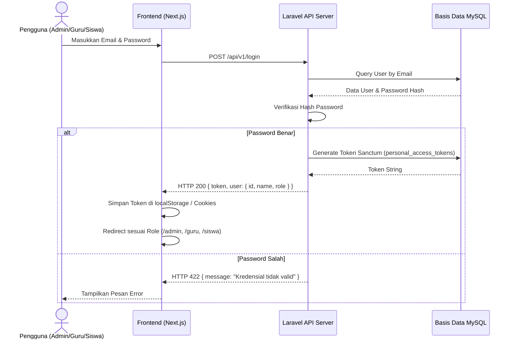
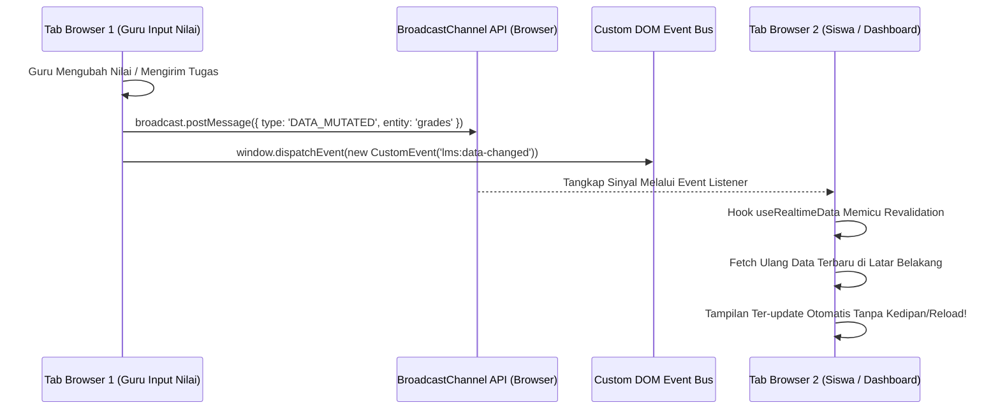

# 🚀 PANDUAN LENGKAP ARSITEKTUR, KODE, JOBDESK DETAIL & MATERI PRESENTASI EDUSCHOOL LMS

> **Dokumen Resmi Presentasi & Bedah Sistem Full-Stack E-Learning**  
> Proyek Praktik Kerja Lapangan (PKL) / Tugas Akhir — Program Studi S1 Informatika  
> Fakultas Teknik dan Ilmu Komputer, Universitas Teknokrat Indonesia & CV Newus Teknologi

---

## 👥 1. IDENTITAS TIM & RINCIAN MENDALAM JOBDESK ANGGOTA

Proyek **EduSchool LMS** dibangun oleh tim beranggotakan 3 orang mahasiswa. Berikut adalah rincian lengkap mengenai **apa yang dibuat**, **tujuan pembuatannya**, **teknologi yang digunakan**, serta **logika bisnis/algoritma (*logic*) yang diterapkan** oleh masing-masing anggota:

```
┌──────────────────────────────────────────────────────────────────────────────────────────┐
│                                STRUKTUR TIM PENGEMBANG                                   │
├───────────────────────────────┬───────────────────────────────┬──────────────────────────┤
│     FERY DWI RAMADHI          │       FATHUR RAMANTHA         │  I PUTU PANDU WIRANATA   │
│       (NPM 23312086)          │        (NPM 23312105)         │      (NPM 23312088)      │
├───────────────────────────────┼───────────────────────────────┼──────────────────────────┤
│ 📌 Posisi / Peran:            │ 📌 Posisi / Peran:            │ 📌 Posisi / Peran:       │
│  • System Analyst             │  • Frontend UI/UX Specialist  │  • Full-Stack Engineer   │
│  • Cloud & DevOps Engineer    │  • Design System & Styling    │    (Frontend & Backend)  │
│  • Database Architect         │  • Client-Side Components     │  • RESTful API Developer │
│  • Dokumentasi Program        │  • Mobile & Micro-Interactions│  • Real-time Sync Logic  │
└───────────────────────────────┴───────────────────────────────┴──────────────────────────┘
```

---

### 👨‍💻 A. FERY DWI RAMADHI (NPM 23312086)
**Peran Utama**: *System Analyst, Cloud & DevOps Engineer, Database Architect, dan Dokumentasi Program*

#### 1. Analisis Kebutuhan Sistem & Pemodelan UML
- **Apa yang Dibuat**:
  - Dokumen *Product Requirements Document* (PRD) yang merinci 50 fitur fungsional untuk 3 peran (Admin, Guru, Siswa).
  - Diagram pemodelan sistem standar UML: **Diagram Use Case Terpadu**, **Diagram Alir (Flowchart) Sistem Terpadu**, serta *Activity & Sequence Diagrams*.
- **Tujuan Pembuatan (Buat Apa)**:
  - Mencegah *scope creep* (pelebaran cakupan proyek yang tidak terarah), menetapkan batasan hak akses pengguna (*Role-Based Access Control*), dan memberikan panduan cetak biru (*blueprint*) alur bisnis yang jelas bagi pengembang frontend dan backend.
- **Teknologi & Tools yang Digunakan**:
  - UML 2.5 Standard, Mermaid.js, Draw.io, dan Markdown PRD.
- **Logika & Alur Kerja (Logic)**:
  - **Matriks Hak Akses (CRUD Matrix)**: Membagi sistem ke dalam 3 hierarki isolasi:
    - *Administrator*: Memiliki hak akses level sistem (CRUD User, Pengaturan Sekolah, Audit Trail, Rekapitulasi Global).
    - *Guru Pengajar*: Memiliki hak akses level kelas (CRUD Materi, Penugasan LKPD, Input Nilai UTS/UAS, Jadwal Presensi).
    - *Peserta Didik*: Memiliki hak akses level konsumsi & partisipasi (Join Kelas, Baca Materi, Kumpul Tugas, Presensi Mandiri, Cek Rapor).

---

#### 2. Perancangan Arsitektur Basis Data Relasional (11 Tabel MySQL)
- **Apa yang Dibuat**:
  - Skema basis data relasional MySQL 8.0 dengan 11 tabel terintegrasi: `users`, `courses`, `course_student`, `materials`, `assignments`, `submissions`, `attendances`, `notifications`, `settings`, `activity_logs`, dan `personal_access_tokens`.
  - Diagram *Entity Relationship Diagram* (ERD) lengkap dengan relasi *One-to-Many* dan *Many-to-Many* (tabel pivot).
- **Tujuan Pembuatan (Buat Apa)**:
  - Menyediakan struktur penyimpanan data akademik yang konsisten, terhindar dari anomali data (anomali insert, update, dan delete), serta mendukung performa query yang cepat.
- **Teknologi & Tools yang Digunakan**:
  - MySQL 8.0, InnoDB Storage Engine, Laravel Eloquent Migrations, B-Tree Indexing.
- **Logika & Alur Kerja (Logic)**:
  - **Normalisasi 3NF (Third Normal Form)**: Memastikan tidak ada redundansi data antar-tabel. Data siswa dan kelas dihubungkan melalui tabel pivot `course_student` (*Many-to-Many*).
  - **Penegakan Integritas Data & Cascade Deletion**: Memasang relasi `ON DELETE CASCADE` pada foreign key relasi anak (misal: jika kelas dihapus, maka seluruh materi, tugas, dan presensi di kelas tersebut ikut terhapus secara otomatis dan aman).
  - **Composite Unique Constraints**: Mencegah duplikasi data kritis, misalnya pada tabel presensi: satu siswa hanya dapat melakukan presensi satu kali per kelas per tanggal kalender:
    ```sql
    UNIQUE KEY `unique_student_course_date` (`user_id`, `course_id`, `date`)
    ```
  - **Indexing Optimization**: Menambahkan indeks pada kolom `email`, `role`, `course_id`, dan `created_at` untuk mempercepat waktu pencarian data.

---

#### 3. Arsitektur Cloud & DevOps Infrastructure (Vercel & Railway)
- **Apa yang Dibuat**:
  - Arsitektur sistem *Decoupled* (pemisahan total antara frontend Next.js dan backend Laravel).
  - Konfigurasi *Cloud Deployment Pipeline* pada platform **Vercel** (Frontend) dan **Railway** (Backend & Database).
  - Pengaturan keamanan CORS (*Cross-Origin Resource Sharing*), SSL/HTTPS, dan *Environment Variables*.
- **Tujuan Pembuatan (Buat Apa)**:
  - Memastikan sistem LMS dapat diakses secara publik selama 24/7 dengan ketersediaan tinggi (*high availability*), kecepatan *caching* global di Edge CDN, serta isolasi server backend yang aman.
- **Teknologi & Tools yang Digunakan**:
  - Vercel Edge Network, Railway Container Engine (PHP 8.2-FPM + Nginx), Git Webhooks, SSL TLS 1.3.
- **Logika & Alur Kerja (Logic)**:
  - **Decoupled Architecture Flow**: Frontend Next.js berjalan secara serverless di CDN global Vercel dan berkomunikasi secara *asynchronous* melalui REST API ke backend container Railway.
  - **CORS Preflight & Credential Handling**: Mengonfigurasi `config/cors.php` dan `config/sanctum.php` dengan whitelist domain origin Vercel (`https://sistem-e-learning-g9xn.vercel.app`) dan mengizinkan header `Authorization: Bearer <token>` serta penanganan request preflight HTTP `OPTIONS`.

---

#### 4. Penyusunan Dokumentasi Teknis & Laporan Resmi PKL/TA
- **Apa yang Dibuat**:
  - Naskah buku Laporan PKL formal berstandar akademik FTIK Universitas Teknokrat Indonesia (file `.docx` resmi).
  - Dokumentasi struktur file, arsitektur sistem, dan panduan instalasi server lokal.
- **Tujuan Pembuatan (Buat Apa)**:
  - Memenuhi syarat kelulusan Praktik Kerja Lapangan dan menyajikan dokumentasi serah terima perangkat lunak profesional bagi CV Newus Teknologi.
- **Teknologi & Tools yang Digunakan**:
  - Python `python-docx`, Markdown, Panduan Akademik FTIK UTI.
- **Logika & Alur Kerja (Logic)**:
  - Menegakkan format pengetikan presisi: Margin Kiri 4 cm, Atas 3 cm, Kanan 3 cm, Bawah 3 cm, font Times New Roman 12pt, spasi 1.5, jarak judul bab 4 cm dari tepi atas, sistem sitasi Harvard, penomoran Romawi di halaman awal dan angka Arab di kanan atas, serta halaman penyekat biru (*blue separator page*) antar-anggota tim di BAB III.

---

### 🎨 B. FATHUR RAMANTHA (NPM 23312105)
**Peran Utama**: *Frontend UI/UX Specialist, Design System Engineer, dan Client-Side Component Developer*

#### 1. Riset Pengguna & Perancangan Antarmuka (UI/UX Figma)
- **Apa yang Dibuat**:
  - Riset alur pengguna (*User Flow*) dan pembuatan *Wireframe Low-Fidelity*.
  - Desain *High-Fidelity Prototype* interaktif di Figma untuk seluruh tampilan (Desktop, Tablet, dan Mobile).
- **Tujuan Pembuatan (Buat Apa)**:
  - Menghadirkan antarmuka pengguna yang bersih, modern, tidak membingungkan guru senior maupun siswa baru, serta memiliki daya tarik visual yang profesional.
- **Teknologi & Tools yang Digunakan**:
  - Figma, Auto-Layout, Component Variants, Color Tokens, Iconography Lucide.
- **Logika & Alur Kerja (Logic)**:
  - **Prinsip Human-Centered Design**: Menempatkan navigasi utama di sisi kiri (*Sidebar* yang dapat di-collapse) dan header profil/notifikasi di bagian atas (*Navbar*).
  - **Skema Warna 60-30-10**: 60% warna netral (*slate/white* background), 30% warna struktural (*dark slate/gray*), dan 10% warna aksen (*Primary Blue #2563EB* untuk tombol aksi utama dan *Emerald Green* untuk indikator status sukses/hadir).

---

#### 2. Pembangunan Design System & Styling (Tailwind CSS v4)
- **Apa yang Dibuat**:
  - Sistem token desain berbasis Tailwind CSS v4 untuk warna, spasi (*spacing*), sudut membulat (*border radius 2xl*), bayangan (*soft elevation shadow*), dan tipografi font modern (Poppins).
  - Tata letak responsif penuh (*Mobile-First Responsive Layout*).
- **Tujuan Pembuatan (Buat Apa)**:
  - Menjamin konsistensi visual di seluruh 30+ halaman sistem dan memastikan aplikasi dapat digunakan dengan nyaman di layar smartphone berukuran kecil tanpa terjadi layout berantakan.
- **Teknologi & Tools yang Digunakan**:
  - Tailwind CSS v4, PostCSS, CSS Grid & Flexbox, Container Queries.
- **Logika & Alur Kerja (Logic)**:
  - **Breakpoint Responsif**: Mengatur breakpoint layar (`sm: 640px`, `md: 768px`, `lg: 1024px`, `xl: 1280px`). Pada layar mobile (<768px), sidebar secara otomatis disembunyikan dan diakses melalui tombol hamburger menu pop-up.
  - **Overflow Table Wrapping**: Tabel data rekap nilai dan presensi dibungkus dengan kelas `overflow-x-auto` agar pengguna mobile dapat melakukan scrolling horizontal secara mulus tanpa memotong konten kartu dashboard.

---

#### 3. Pengembangan 3 Dashboard Khusus & Pustaka 20+ Komponen Next.js
- **Apa yang Dibuat**:
  - 3 Dashboard khusus berbasis peran:
    - **Dashboard Administrator**: Statistik ringkasan sekolah, grafik aktivitas mingguan, tabel manajemen pengguna dengan filter dinamis.
    - **Dashboard Guru Pengajar**: Katalog kelas yang diampu, ringkasan tugas terkumpul yang belum dinilai, jadwal absensi harian, dan akses cepat materi.
    - **Dashboard Peserta Didik**: Tampilan kelas terdaftar (*CourseCard*), tenggat waktu tugas terdekat (*Deadline Tracker*), tombol presensi interaktif, dan grafik nilai rapor.
  - Pustaka 20+ komponen *reusable*: `Navbar`, `Sidebar`, `StatCard`, `CourseCard`, `ModalDialog`, `FileUploader`, `NotificationBell`, `SkeletonLoader`, dan `GradeInputForm`.
- **Tujuan Pembuatan (Buat Apa)**:
  - Menerapkan prinsip *Don't Repeat Yourself* (DRY), mempercepat proses pembuatan halaman baru, dan memastikan isolasi fungsionalitas antarmuka antar-peran.
- **Teknologi & Tools yang Digunakan**:
  - Next.js 15 (App Router), React 19 Client Components, Lucide React Icons, Recharts Data Visualization.
- **Logika & Alur Kerja (Logic)**:
  - **Atomic Design Composition**: Membangun komponen dari unit terkecil (*Atoms* seperti Button & Badge), digabungkan menjadi *Molecules* (`CourseCard` & `StatCard`), lalu dirangkai menjadi *Organisms* (`Navbar` & `Sidebar`) dan halaman utama.
  - **Role-Based Dynamic Navigation**: Komponen `Sidebar.tsx` membaca objek peran pengguna (`user.role`) dan secara dinamis hanya menampilkan menu yang diizinkan untuk peran tersebut.

---

#### 4. Optimasi Pengalaman Pengguna (UX, Pencegahan CLS & Animasi)
- **Apa yang Dibuat**:
  - Komponen *Skeleton Loaders* untuk seluruh kartu metrik, tabel, dan daftar kelas.
  - Penanganan status formulir interaktif (*loading spinner* dan penonaktifan tombol submit ganda).
  - Efek perayaan visual animasi konfeti (*Canvas-Confetti*).
- **Tujuan Pembuatan (Buat Apa)**:
  - Menghilangkan kedipan pergeseran tata letak saat data sedang dimuat dari server, mencegah pengiriman data ganda (*duplicate submission*), dan memberikan kepuasan visual saat siswa menyelesaikan tugas.
- **Teknologi & Tools yang Digunakan**:
  - Canvas-Confetti, Tailwind Animation Keyframes, Lucide Spinners.
- **Logika & Alur Kerja (Logic)**:
  - **Pencegahan Cumulative Layout Shift (CLS)**: Menampilkan placeholder abu-abu beranimasi pulsa (`animate-pulse`) dengan ukuran tinggi dan lebar yang persis sama dengan elemen aslinya sebelum data API selesai dimuat.
  - **State isSubmitting**: Mengunci tombol aksi (`disabled={isSubmitting}`) saat proses HTTP berlangsung untuk mencegah pengguna mengklik tombol berkali-kali.

---

### ⚡ C. I PUTU PANDU WIRANATA (NPM 23312088)
**Peran Utama**: *Full-Stack Engineer (Frontend & Backend Integration), RESTful API Developer, dan State Management Specialist*

#### 1. Pembangunan 50+ Endpoint RESTful API Backend (Laravel 12)
- **Apa yang Dibuat**:
  - Arsitektur backend API yang kokoh dan modular di bawah *namespace* `/api/v1` dengan 12 controller utama:
    - `AuthController`: Registrasi, Login, Logout, Profil Pengguna, Reset Password.
    - `CourseController`: CRUD data kelas, generate kode kelas unik, pendaftaran siswa ke kelas.
    - `MaterialController`: Upload modul materi, link YouTube/Drive, pratinjau dokumen.
    - `AssignmentController`: Pembuatan penugasan LKPD, setting bobot nilai dan deadline.
    - `SubmissionController`: Upload file jawaban tugas siswa, form koreksi dan pemberian nilai/feedback oleh guru.
    - `AttendanceController`: Pencatatan absensi siswa mandiri, riwayat kehadiran, rekapitulasi kelas.
    - `ReportController`: Perhitungan nilai rapor semester dan ekspor berkas Excel.
    - `AdminController`: Manajemen akun (CRUD), statistik global sekolah, bulk import spreadsheet.
    - `NotificationController`: Pengambilan notifikasi real-time, penandaan notifikasi telah dibaca.
- **Tujuan Pembuatan (Buat Apa)**:
  - Menyediakan layanan logika bisnis dan manipulasi data yang cepat, aman, dan dapat diandalkan oleh antarmuka frontend.
- **Teknologi & Tools yang Digunakan**:
  - Laravel 12 Framework, PHP 8.2+, Eloquent ORM, Request Form Validation, JSON Response Standard.
- **Logika & Alur Kerja (Logic)**:
  - **Standar Respon API Konsisten**: Seluruh endpoint mengembalikan format JSON standar:
    ```json
    {
      "success": true,
      "message": "Data berhasil diproses",
      "data": { ... }
    }
    ```
  - **Sanitisasi & Normalisasi Input**: Menghindari kesalahan validasi akibat variasi penulisan huruf besar/kecil dengan menerapkan `strtolower(trim($request->input))` pada data sensitif seperti peran pengguna dan status presensi.

---

#### 2. Keamanan Autentikasi & Otorisasi (Laravel Sanctum & RBAC)
- **Apa yang Dibuat**:
  - Sistem otentikasi berbasis *Bearer Token* menggunakan Laravel Sanctum.
  - Middleware otorisasi *Role-Based Access Control* (RBAC) pada rute backend.
- **Tujuan Pembuatan (Buat Apa)**:
  - Menjamin keamanan setiap transaksi data dan memastikan pengguna hanya dapat mengakses fitur yang sesuai dengan hak akses perannya.
- **Teknologi & Tools yang Digunakan**:
  - Laravel Sanctum, Bcrypt Hashing, Middleware Guards (`auth:sanctum`, `check.role`).
- **Logika & Alur Kerja (Logic)**:
  - **Token Generation**: Saat login berhasil, server menerbitkan token *plain text* yang unik dan menyimpan hash token tersebut pada tabel `personal_access_tokens`.
  - **Middleware Inspection**: Setiap request yang masuk diperiksa header `Authorization: Bearer <token>`. Jika token valid, middleware mengecek apakah kolom `user.role` sesuai dengan rute yang diakses. Jika siswa mencoba mengakses endpoint `/api/v1/admin/*`, server langsung mengembalikan kode HTTP `403 Forbidden`.

---

#### 3. Logika Presensi Mandiri Siswa Berbasis Jendela Waktu (Time-Window Schedule)
- **Apa yang Dibuat**:
  - Modul absensi mandiri siswa dengan validasi rentang jam operasional kelas.
- **Tujuan Pembuatan (Buat Apa)**:
  - Menggantikan presensi manual di kelas dengan sistem digital mandiri yang jujur dan tertib waktu.
- **Teknologi & Tools yang Digunakan**:
  - Nesbot Carbon Time Library (Timezone Asia/Jakarta / WIB), Attendance Model.
- **Logika & Alur Kerja (Logic)**:
  - **Time Comparison Algorithm**: Mengambil waktu saat ini pada server:
    ```php
    $now = Carbon::now('Asia/Jakarta');
    $startTime = Carbon::parse($course->attendance_start);
    $endTime = Carbon::parse($course->attendance_end);
    
    if (!$now->between($startTime, $endTime)) {
        return response()->json([
            'success' => false,
            'message' => 'Presensi ditutup. Jam absensi: ' . $startTime->format('H:i') . ' - ' . $endTime->format('H:i') . ' WIB'
        ], 422);
    }
    ```
  - **Anti-Duplikasi Presensi**: Menggunakan query `Attendance::updateOrCreate()` berdasarkan kombinasi `user_id`, `course_id`, dan `date` sehingga seorang siswa tidak dapat membuat data presensi ganda pada hari yang sama.

---

#### 4. Modul Penilaian, Rekapitulasi Nilai Rapor & Ekspor Excel
- **Apa yang Dibuat**:
  - Modul perhitungan nilai rapor semester (LKPD, UTS, UAS) dan pembuatan file unduhan Microsoft Excel (.xlsx).
- **Tujuan Pembuatan (Buat Apa)**:
  - Mengotomatiskan proses rekapitulasi nilai guru yang sebelumnya memakan waktu berhari-hari menjadi hitungan detik.
- **Teknologi & Tools yang Digunakan**:
  - Eloquent Aggregation (`avg`, `sum`), Maatwebsite Excel, Laravel Download Response.
- **Logika & Alur Kerja (Logic)**:
  - **Formula Pembobotan Nilai Rapor**:
    $$\text{Nilai Akhir} = (\text{Rata-rata LKPD} \times 0.40) + (\text{Nilai UTS} \times 0.30) + (\text{Nilai UAS} \times 0.30)$$
  - **Formatting Ekspor Excel**: Menata format sheet Excel dengan header tabel tebal (*bold*), garis pembatas sel (*borders*), perataan teks tengah untuk NISN/Nilai, dan penamaan file dinamis: `Rekap_Nilai_Kelas_{ID}_{Tanggal}.xlsx`.

---

#### 5. Modul Bulk Import Spreadsheet 50+ Akun Pengguna
- **Apa yang Dibuat**:
  - Fitur unggah file Excel/CSV untuk pendaftaran massal puluhan hingga ratusan akun pengguna sekaligus.
- **Tujuan Pembuatan (Buat Apa)**:
  - Memudahkan pihak tata usaha/administrator sekolah dalam mendaftarkan seluruh siswa dan guru baru tanpa harus menginput data satu per satu secara manual.
- **Teknologi & Tools yang Digunakan**:
  - Maatwebsite Excel Importer, DB Transactions (`DB::beginTransaction`), Hash Password.
- **Logika & Alur Kerja (Logic)**:
  - **Atomic Transaction & Validation**:
    1. Membaca header file Excel: `['Nama Lengkap', 'Email', 'Role', 'Kelas/Mapel']`.
    2. Jika kolom tidak sesuai template, gagalkan proses dan kirim notifikasi error.
    3. Loop setiap baris data: enkripsi password default `Hash::make('password')`, masukkan ke database.
    4. Jika ada email yang duplikat, lakukan `DB::rollBack()` dan laporkan baris yang bermasalah.
    5. Jika seluruh baris valid, lakukan `DB::commit()` dan terbitkan data pengguna baru secara instan.

---

#### 6. Integrasi Client API & Sinkronisasi Real-Time Lintas Tab (`useRealtimeData`)
- **Apa yang Dibuat**:
  - Modul client API sentral (`Frontend/lib/api.ts`).
  - Hook sinkronisasi data instan (`Frontend/hooks/useRealtimeData.ts`) berbasis browser event.
- **Tujuan Pembuatan (Buat Apa)**:
  - Menghubungkan seluruh antarmuka Next.js dengan API Laravel secara mulus dan memastikan data antar-tab browser pengguna selalu terbarui secara *real-time* tanpa perlu menekan tombol refresh halaman secara manual.
- **Teknologi & Tools yang Digunakan**:
  - Fetch API, `localStorage`, `BroadcastChannel API` (HTML5), Custom DOM Events (`window.dispatchEvent`), React `useEffect` & `useCallback`.
- **Logika & Alur Kerja (Logic)**:
  - **Hybrid Event-Driven Invalidation**:
    1. Saat operasi mutasi data (`POST`, `PUT`, `DELETE`) selesai di `api.ts`, browser memancarkan pesan ke kanal `new BroadcastChannel('lms_realtime_sync')`.
    2. Tab browser lain yang sedang membuka halaman siswa/guru menangkap pesan tersebut melalui *event listener*.
    3. Hook `useRealtimeData` seketika menjalankan fungsi fetcher ulang di latar belakang (*background revalidation*).
    4. Tampilan data (misal nilai baru atau presensi baru) langsung ter-update di layar siswa dalam hitungan milidetik tanpa kedipan atau reload browser.

---

## 💻 2. TEKNOLOGI & TECH STACK YANG DIGUNAKAN (WHY & HOW)

Sistem mengadopsi arsitektur **Decoupled Web Architecture** (pemisahan total antara antarmuka klien dan server API):

```
                       ┌─────────────────────────────────────────┐
                       │           CLIENT LAYER (Edge)           │
                       │           Vercel Cloud Hosting          │
                       │   Next.js 15 • React 19 • TypeScript    │
                       └────────────────────┬────────────────────┘
                                            │
                                            │ HTTPS / JSON (REST API)
                                            │ Bearer Token (Sanctum)
                                            ▼
                       ┌─────────────────────────────────────────┐
                       │          BACKEND LAYER (Server)         │
                       │          Railway Cloud Hosting          │
                       │        Laravel 12 (PHP 8.2 / FPM)       │
                       └────────────────────┬────────────────────┘
                                            │
                                            │ TCP / SQL Queries
                                            │ Eloquent ORM
                                            ▼
                       ┌─────────────────────────────────────────┐
                       │             DATABASE LAYER              │
                       │          MySQL 8.0 Managed DB           │
                       │          11 Relational Tables           │
                       └─────────────────────────────────────────┘
```

---

## 📁 3. BEDAH STRUKTUR FOLDER LENGKAP

Berikut adalah peta struktur direktori proyek beserta fungsi dari masing-masing folder dan file:

```
Sistem-E-learning-main/
│
├── Frontend/                             # 🌐 KODE SUMBER FRONTEND (Next.js)
│   ├── app/                              # Sistem Routing Next.js (App Router)
│   │   ├── admin/                        # Dashboard & Modul Administrator
│   │   │   ├── users/                    # Kelola Pengguna (Tambah, Edit, Hapus, Import)
│   │   │   ├── reports/                  # Rekapitulasi Presensi & Nilai Global
│   │   │   ├── settings/                 # Pengaturan Sekolah & Logo
│   │   │   └── page.tsx                  # Dashboard Admin (Grafik & Statistik)
│   │   ├── guru/                         # Dashboard & Modul Guru Pengajar
│   │   │   ├── kelas/                    # Manajemen Kelas & Anggota Siswa
│   │   │   │   └── [id]/                 # Detail Kelas (Tab Materi, Tugas, Absensi, Anggota)
│   │   │   ├── materi/                   # Kelola Modul & Lampiran Bahan Ajar
│   │   │   ├── tugas/                    # Buat Tugas LKPD & Penilaian Jawaban
│   │   │   ├── absensi/                  # Atur Jadwal & Rekap Presensi Kelas
│   │   │   ├── nilai/                    # Input Nilai UTS & UAS
│   │   │   └── page.tsx                  # Dashboard Guru
│   │   ├── siswa/                        # Dashboard & Modul Peserta Didik
│   │   │   ├── kelas/                    # Katalog Kelas & Belajar Online
│   │   │   │   └── [id]/                 # Ruang Kelas Siswa (Akses Materi & Absen)
│   │   │   ├── tugas/                    # Daftar Tugas & Form Pengumpulan (Submit)
│   │   │   ├── absensi/                  # Riwayat & Tombol Presensi Mandiri
│   │   │   ├── nilai/                    # Tampilan Rapor & Nilai Mandiri
│   │   │   └── page.tsx                  # Dashboard Siswa
│   │   ├── login/                        # Halaman Login Multi-Role & Demo Account
│   │   ├── reset-password/               # Halaman Reset Kata Sandi
│   │   ├── layout.tsx                    # Root Layout (Font, Metadata, Providers)
│   │   └── globals.css                   # Global CSS & Tailwind CSS Config
│   │
│   ├── components/                       # Komponen UI Reusable
│   │   ├── Navbar.tsx                    # Header Atas (Profil, Lonceng Notifikasi)
│   │   ├── Sidebar.tsx                   # Navigasi Kiri Dinamis Sesuai Role
│   │   ├── StatCard.tsx                  # Kartu Metrik Statistik
│   │   ├── CourseCard.tsx                # Kartu Tampilan Kelas
│   │   └── ModalDialog.tsx               # Modal Dialog Pop-up
│   │
│   ├── hooks/                            # Custom React Hooks
│   │   ├── useAuth.ts                    # Hook Manajemen Sesi Login & Role Check
│   │   ├── useRealtimeData.ts            # Hook Sinkronisasi Real-time Lintas Tab
│   │   └── useNotifications.ts           # Hook Polling & Ambil Notifikasi Real-time
│   │
│   ├── lib/                              # Utility & API Integration
│   │   └── api.ts                        # Central API Client (Semua Fetch/Axios Request)
│   │
│   └── types/                            # TypeScript Type Definitions
│       └── index.ts                      # Interface User, Course, Assignment, dll.
│
├── backend/                              # ⚙️ KODE SUMBER BACKEND (Laravel 12)
│   ├── app/
│   │   ├── Http/Controllers/Api/         # Controller API (Logika Bisnis)
│   │   │   ├── AuthController.php        # Login, Logout, User Profile, Token
│   │   │   ├── AdminController.php       # CRUD Pengguna, Bulk Import, Stats
│   │   │   ├── CourseController.php      # CRUD Kelas, Tambah Siswa ke Kelas
│   │   │   ├── MaterialController.php    # Upload Modul & Tautan Pembelajaran
│   │   │   ├── AssignmentController.php  # Buat Tugas, Deadline, Bobot Nilai
│   │   │   ├── SubmissionController.php  # Kumpul Tugas Siswa, Penilaian Guru
│   │   │   ├── AttendanceController.php  # Presensi Mandiri & Validasi Waktu
│   │   │   ├── ReportController.php      # Rekap Nilai Rapor & Ekspor Excel
│   │   │   └── NotificationController.php# Ambil Notifikasi & Tandai Terbaca
│   │   │
│   │   └── Models/                       # Eloquent Models (Relasi Antar Tabel)
│   │       ├── User.php                  # Model Pengguna (Admin, Guru, Siswa)
│   │       ├── Course.php                # Model Kelas/Mata Pelajaran
│   │       ├── Material.php              # Model Bahan Ajar
│   │       ├── Assignment.php            # Model Penugasan LKPD
│   │       ├── Submission.php            # Model Jawaban Tugas Siswa
│   │       ├── Attendance.php            # Model Presensi Siswa
│   │       └── Notification.php          # Model Notifikasi
│   │
│   ├── database/
│   │   ├── migrations/                   # Skema Migrasi 11 Tabel MySQL
│   │   └── seeders/                      # Seeder Data Awal & Demo Users
│   │
│   ├── routes/
│   │   └── api.php                       # Definisi 50+ Endpoint RESTful API
│   │
│   └── config/
│       ├── cors.php                      # Konfigurasi Cross-Origin Security
│       └── sanctum.php                   # Konfigurasi Token Session Sanctum
│
├── docs/                                 # 📚 DOKUMENTASI LOKAL & LAPORAN PKL (Diabaikan dari Git)
│   ├── diagrams/                         # Aset Gambar Diagram (PNG & SVG)
│   ├── DIAGRAMS_DOKUMENTASI.md           # Penjelasan Lengkap Diagram UML & Flowchart
│   ├── BUKU PANDUAN LAPORAN PKL FTIK.pdf # Buku Acuan Standar FTIK
│   └── Laporan_PKL_FTIK_Teknokrat_...docx# File Naskah Word Laporan PKL Resmi
│
├── ACCOUNTS_README.md                    # 🔑 Daftar 54 Akun Username & Password Lengkap
└── README.md                             # 📖 Ringkasan Proyek & Panduan Setup
```

---

## 🔄 4. ALUR KERJA SISTEM (SYSTEM FLOW & BUSINESS LOGIC)

### 1. Alur Autentikasi & Otorisasi Berbasis Peran (RBAC Flow)


---

### 2. Alur Presensi Mandiri Siswa (Time-Window Validation)


---

### 3. Alur Penugasan LKPD & Penilaian (Assignment & Grading Flow)
```
[GURU]                              [SISTEM LMS]                           [SISWA]
  │                                      │                                    │
  ├── 1. Buat Tugas LKPD ───────────────>│                                    │
  │   (Judul, Deadline, Bobot)           │── 2. Kirim Notifikasi Tugas Baru ─>│
  │                                      │                                    ├── 3. Buka Tugas & Unduh Soal
  │                                      │                                    │
  │                                      │<── 4. Upload File Jawaban / Teks ──┤
  │                                      │    (POST /api/v1/submissions)      │
  │                                      │                                    │
  │<── 5. Muncul Notifikasi Pengumpulan ─┤                                    │
  │                                      │                                    │
  ├── 6. Beri Nilai (0-100) & Feedback ─>│                                    │
  │                                      │── 7. Update Nilai ke Rapor Siswa ─>│
  │                                      │                                    └── 8. Nilai Langsung Terlihat!
```

---

### 4. Alur Sinkronisasi Real-time Lintas Tab (`useRealtimeData`)


---

## 🔍 5. PENJELASAN KODE PROGRAM INTI (CODE DEEP DIVE)

### A. Client API Centralized (`Frontend/lib/api.ts`)
```typescript
// Contoh implementasi di Frontend/lib/api.ts
async function customFetch(endpoint: string, options: RequestInit = {}) {
  const token = typeof window !== 'undefined' ? localStorage.getItem('token') : null;
  const headers = {
    'Content-Type': 'application/json',
    'Accept': 'application/json',
    ...(token ? { 'Authorization': `Bearer ${token}` } : {}),
    ...options.headers,
  };

  const response = await fetch(`${process.env.NEXT_PUBLIC_API_URL}${endpoint}`, {
    ...options,
    headers,
  });

  // Jika operasi mengubah data, pancarkan sinyal real-time
  if (['POST', 'PUT', 'DELETE'].includes(options.method || 'GET')) {
    if (typeof window !== 'undefined') {
      const channel = new BroadcastChannel('lms_realtime_sync');
      channel.postMessage({ type: 'DATA_MUTATED', endpoint });
      window.dispatchEvent(new CustomEvent('lms:data-changed', { detail: { endpoint } }));
    }
  }

  return response.json();
}
```

---

### B. Hook Real-time Sinkronisasi (`Frontend/hooks/useRealtimeData.ts`)
```typescript
// Frontend/hooks/useRealtimeData.ts
export function useRealtimeData(fetcher: () => void, dependencies = []) {
  useEffect(() => {
    // 1. Eksekusi awal pengambilan data
    fetcher();

    // 2. Pasang pendengar BroadcastChannel (Antar-tab)
    const channel = new BroadcastChannel('lms_realtime_sync');
    channel.onmessage = () => {
      fetcher(); // Ambil data baru saat tab lain melakukan mutasi
    };

    // 3. Pasang pendengar Window Focus (Saat user kembali ke tab ini)
    const onFocus = () => fetcher();
    window.addEventListener('focus', onFocus);

    return () => {
      channel.close();
      window.removeEventListener('focus', onFocus);
    };
  }, dependencies);
}
```

---

### C. Backend Controller & Normalisasi Validasi (Laravel 12)
```php
// Backend AttendanceController.php
public function store(Request $request)
{
    $request->validate([
        'course_id' => 'required|exists:courses,id',
        'status' => 'required|string',
    ]);

    // Normalisasi case-sensitivity (menghindari error huruf besar/kecil)
    $normalizedStatus = strtolower(trim($request->status));
    
    $attendance = Attendance::updateOrCreate(
        [
            'user_id' => auth()->id(),
            'course_id' => $request->course_id,
            'date' => Carbon::now('Asia/Jakarta')->toDateString(),
        ],
        [
            'status' => $normalizedStatus,
            'time' => Carbon::now('Asia/Jakarta')->toTimeString(),
        ]
    );

    return response()->json([
        'success' => true,
        'message' => 'Presensi berhasil dicatat!',
        'data' => $attendance
    ], 200);
}
```

---

## 🎤 6. SKENARIO & RANCANGAN SLIDE PRESENTASI TIM

Berikut adalah panduan pembagian giliran bicara (*Script Presentasi*) yang telah disesuaikan dengan rincian *jobdesk* mendalam masing-masing anggota:

### 🎬 Pembukaan (Moderator / Tim)
> *"Selamat pagi/siang Bapak/Ibu Dosen Penguji dan Pembimbing. Kami dari kelompok PKL S1 Informatika Universitas Teknokrat Indonesia di CV Newus Teknologi ingin mempresentasikan hasil proyek sistem kami yang berjudul **EduSchool: Sistem Learning Management System (LMS) Terpadu Berbasis Next.js dan Laravel 12**."*

---

### 🗣️ Bagian 1: FERY DWI RAMADHI (System Analyst, Cloud & DevOps, Database)
**Materi yang Dipresentasikan**:
1. **Latar Belakang & Analisis Kebutuhan Sistem**:
   - Menjelaskan masalah mendasar dalam pembelajaran daring konvensional dan penjabaran 50 fitur fungsional dalam dokumen PRD.
2. **Pemodelan UML & Arsitektur Decoupled**:
   - Memaparkan diagram Use Case terpadu dan Flowchart sistem.
   - Menjelaskan arsitektur *Decoupled* (Next.js di Vercel + Laravel di Railway + MySQL 8.0).
3. **Desain Basis Data Relasional & Cloud Deployment**:
   - Menunjukkan diagram ERD (11 tabel relasional), relasi foreign keys, indexing, dan cascade deletion.
   - Menjelaskan konfigurasi cloud production di Vercel dan Railway (keamanan CORS, SSL, dan environment variables).

---

### 🗣️ Bagian 2: FATHUR RAMANTHA (Frontend UI/UX Specialist)
**Materi yang Dipresentasikan**:
1. **Perancangan Desain UI/UX di Figma**:
   - Menjelaskan prinsip *Human-Centered Design*, hierarki informasi, dan sistem warna 60-30-10.
2. **Implementasi Design System Tailwind CSS & Responsivitas**:
   - Menunjukkan bagaimana tata letak menyesuaikan secara mulus di berbagai ukuran layar (*Mobile-First Design*).
3. **Demonstrasi 3 Dashboard Khusus & Pustaka Komponen**:
   - Mendemokan **Dashboard Admin**, **Dashboard Guru**, dan **Dashboard Siswa**.
   - Menjelaskan solusi pencegahan CLS (*Cumulative Layout Shift*) menggunakan *Skeleton Loaders* dan penanganan status form interaktif.

---

### 🗣️ Bagian 3: I PUTU PANDU WIRANATA (Full-Stack Engineer - Frontend & Backend)
**Materi yang Dipresentasikan**:
1. **Pembangunan RESTful API Laravel 12 & Keamanan Sanctum**:
   - Menjelaskan struktur 50+ endpoint API, autentikasi Bearer Token, dan middleware otorisasi RBAC.
2. **Demonstrasi Fitur Unggulan Sistem**:
   - **Sinkronisasi Real-Time Lintas Tab**: Membuka dua browser sekaligus (Guru menginput nilai / membuat tugas, layar Siswa langsung ter-update seketika tanpa reload via `BroadcastChannel`).
   - **Presensi Mandiri Terjadwal**: Validasi jendela waktu presensi berbasis server time (WIB).
   - **Rekapitulasi Nilai Rapor & Bulk Import Excel**: Otomatisasi pembobotan nilai rapor dan import 50+ akun pengguna dalam 1 kali klik.

---

### 🎯 7. PERTANYAAN YANG SERING DITANYAKAN (FAQ) & JAWABAN TEKNIS

| Pertanyaan Penguji | Jawaban Teknis yang Direkomendasikan |
| :--- | :--- |
| **1. Mengapa memisahkan Frontend (Next.js) dan Backend (Laravel) daripada monolitik Blade?** | *"Dengan memisahkan frontend dan backend, kami mendapatkan keunggulan arsitektur modern: frontend berjalan sangat cepat di Edge CDN (Vercel) dengan pengalaman SPA (Single Page Application) yang mulus, sementara backend Laravel berfokus penuh sebagai API Service yang aman dan terukur. Jika di masa depan ingin dibuat aplikasi mobile (misal Flutter/React Native), API yang sama bisa langsung digunakan kembali tanpa perlu menulis ulang backend."* |
| **2. Bagaimana cara mengamankan API agar tidak sembarang orang bisa mengakses data nilai atau kelas?** | *"Kami menerapkan otorisasi berlapis: Pertama, autentikasi menggunakan **Laravel Sanctum Bearer Token** yang di-hash di database. Kedua, kami memasang **Middleware Role-Based Access Control (RBAC)** di setiap rute API, sehingga misalnya token siswa tidak akan pernah bisa mengakses endpoint manajemen user admin ataupun endpoint input nilai guru."* |
| **3. Bagaimana mekanisme real-time data bekerja tanpa menggunakan WebSocket yang boros resource?** | *"Kami menggunakan pendekatan **Hybrid Event-Driven Sync** via `BroadcastChannel API` bawaan browser dan custom hook `useRealtimeData`. Setiap mutasi data di sisi client memancarkan sinyal ke seluruh tab yang aktif untuk melakukan revalidasi query data terbaru di background. Pendekatan ini sangat hemat daya, tidak membebani server dengan koneksi socket terbuka terus-menerus, dan memiliki fallback window focus revalidation."* |
| **4. Bagaimana jika pengguna mengunggah file Excel import yang formatnya salah?** | *"Backend kami dilengkapi validasi header otomatis menggunakan pustaka Maatwebsite Excel. Jika susunan kolom atau format data tidak sesuai dengan template master, sistem akan membatalkan transaksi database secara aman (`DB::rollBack()`) dan menampilkan notifikasi kesalahan yang spesifik kepada administrator."* |

---

<div align="center">

**EduSchool LMS — Siap untuk Presentasi Akademik & Industri dengan Kualitas Terbaik! 🎓✨**

</div>
