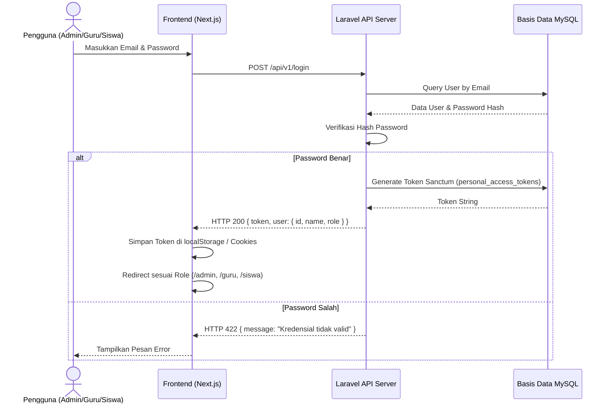
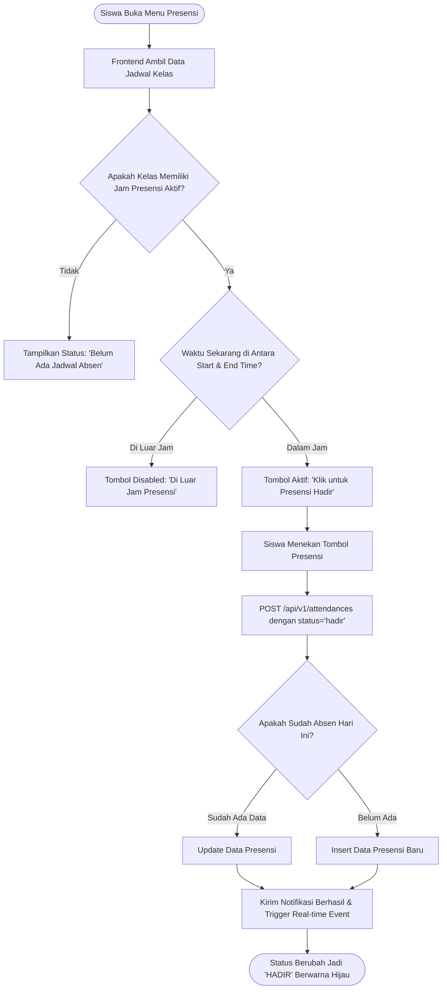
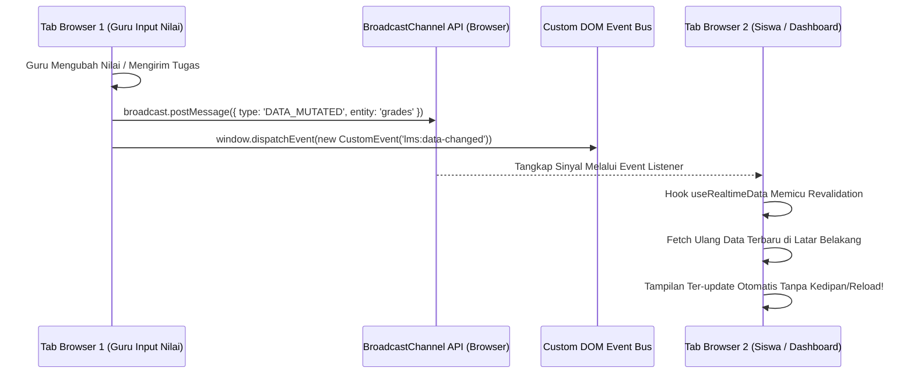

# 🚀 PANDUAN LENGKAP ARSITEKTUR, KODE, JOBDESK & MATERI PRESENTASI EDUSCHOOL LMS

> **Dokumen Resmi Presentasi & Bedah Sistem Full-Stack E-Learning**  
> Proyek Praktik Kerja Lapangan (PKL) / Tugas Akhir — Program Studi S1 Informatika  
> Fakultas Teknik dan Ilmu Komputer, Universitas Teknokrat Indonesia & CV Newus Teknologi

---

## 👥 1. IDENTITAS TIM & RINCIAN LENGKAP JOBDESK ANGGOTA

Proyek **EduSchool LMS** dibangun oleh tim beranggotakan 3 orang mahasiswa dengan pembagian tugas (*job description*) yang sangat mendalam dan terstruktur:

```
┌──────────────────────────────────────────────────────────────────────────────────────────┐
│                                STRUKTUR TIM PENGEMBANG                                   │
├───────────────────────────────┬───────────────────────────────┬──────────────────────────┤
│     FERY DWI RAMADHI          │       FATHUR RAMANTHA         │  I PUTU PANDU WIRANATA   │
│       (NPM 23312086)          │        (NPM 23312105)         │      (NPM 23312088)      │
├───────────────────────────────┼───────────────────────────────┼──────────────────────────┤
│ 📌 Posisi / Peran:            │ 📌 Posisi / Peran:            │ 📌 Posisi / Peran:       │
│  • System Analyst             │  • Frontend UI/UX Specialist  │  • Full-Stack Engineer   │
│  • Cloud & DevOps Engineer    │  • Design System & Styling    │    (Frontend & Backend)  │
│  • Database Architect         │  • Client-Side Components     │  • RESTful API Developer │
│  • Dokumentasi Program        │  • Mobile & Micro-Interactions│  • Real-time Sync Logic  │
└───────────────────────────────┴───────────────────────────────┴──────────────────────────┘
```

---

### 👨‍💻 A. FERY DWI RAMADHI (NPM 23312086)
**Peran**: *System Analyst, Cloud & DevOps Engineer, Database Architect, dan Dokumentasi Program*

#### 📋 Rincian Jobdesk & Tanggung Jawab Lengkap:
1. **Analisis Kebutuhan Sistem & Pemodelan UML**:
   - Menyusun *Product Requirements Document* (PRD) yang mendefinisikan kebutuhan fungsional dan non-fungsional untuk 3 peran pengguna (Administrator, Guru, dan Siswa).
   - Merancang diagram pemodelan sistem formal:
     - **Diagram Use Case Terpadu**: Memetakan 50 fitur fungsional antar-aktor.
     - **Diagram Alir (Flowchart) Sistem Terpadu**: Menetapkan alur kerja bisnis dari login, autentikasi, navigasi peran, hingga manajemen kelas dan penilaian.
     - **Activity Diagram & Sequence Diagram**: Menjelaskan alur pertukaran pesan antara client browser, server API, dan basis data.
2. **Perancangan Arsitektur Basis Data (Database Architecture)**:
   - Merancang skema basis data relasional MySQL 8.0 yang terdiri atas 11 tabel relasional terintegrasi: `users`, `courses`, `course_student`, `materials`, `assignments`, `submissions`, `attendances`, `notifications`, `settings`, `activity_logs`, dan `personal_access_tokens`.
   - Mengonstruksi Entity Relationship Diagram (ERD) lengkap dengan relasi *One-to-Many* dan *Many-to-Many* (tabel pivot).
   - Menetapkan aturan integritas data: *Primary Keys*, *Foreign Keys*, *Unique Constraints*, pengindeksan kolom (*indexing* untuk query cepat), dan *Cascade Deletion* guna mencegah data yatim (*orphan data*).
3. **Arsitektur Cloud & DevOps Infrastructure**:
   - Merancang arsitektur sistem *Decoupled* (pemisahan total antara frontend Next.js dan backend Laravel).
   - Menyiapkan infrastruktur produksi pada platform **Vercel** untuk Frontend Next.js dengan optimasi *Edge Network / CDN Caching*.
   - Menyiapkan infrastruktur produksi pada platform **Railway** untuk Backend Laravel (Runtime PHP 8.2 FPM, Composer, Nginx reverse proxy) dan Managed Database MySQL 8.0.
   - Mengelola konfigurasi keamanan lingkungan: *Environment Variables* (`.env`), *Cross-Origin Resource Sharing* (CORS), integrasi SSL/HTTPS, dan pemetaan domain kustom.
4. **Penyusunan Dokumentasi Teknis & Laporan Resmi**:
   - Menyusun buku naskah Laporan PKL formal 100% berstandar panduan akademik FTIK Universitas Teknokrat Indonesia (format margin 4-3-3-3 cm, Times New Roman 12pt, spasi 1.5, kertas penyekat biru, sistem sitasi Harvard, dan penomoran Romawi/Arab).
   - Menyusun dokumentasi diagram teknis, manual instalasi server lokal, serta panduan arsitektur sistem.

---

### 🎨 B. FATHUR RAMANTHA (NPM 23312105)
**Peran**: *Frontend UI/UX Specialist, Design System Engineer, dan Client-Side Component Developer*

#### 📋 Rincian Jobdesk & Tanggung Jawab Lengkap:
1. **Riset Pengguna & Perancangan Desain Antarmuka (UI/UX Design)**:
   - Melakukan riset kebutuhan antarmuka pengguna berbasis prinsip *Human-Centered Design*.
   - Merancang *Wireframe Low-Fidelity* untuk menyusun tata letak (*layout grid*) dan hierarki informasi.
   - Membangun *High-Fidelity Mockup & Interactive Prototype* di Figma dengan palet warna modern, kontras yang nyaman di mata, dan tipografi sans-serif modern (Poppins / Inter).
2. **Pembangunan Design System & Styling (Tailwind CSS v4)**:
   - Mengonfigurasi arsitektur token desain Tailwind CSS (variabel warna, spasi, bayangan/shadow, radius rounded, dan transisi).
   - Membangun antarmuka yang sepenuhnya responsif (*Mobile-First Design*) sehingga tampilan tetap rapi dan proporsional di berbagai perangkat (smartphone, tablet, laptop, dan layar monitor desktop besar).
3. **Pengembangan Halaman & Komponen Antarmuka Next.js (30+ Halaman & 20+ Komponen)**:
   - Membangun 3 dashboard khusus dengan tampilan dan tata letak yang disesuaikan untuk masing-masing peran:
     - **Dashboard Administrator**: Statistik global sekolah, grafik aktivitas mingguan, tabel manajemen pengguna dengan filter dinamis.
     - **Dashboard Guru Pengajar**: Katalog kelas yang diampu, ringkasan tugas terkumpul yang belum dinilai, jadwal absensi harian, dan akses cepat materi.
     - **Dashboard Peserta Didik**: Tampilan kelas terdaftar (*CourseCard*), tenggat waktu tugas terdekat (*Deadline Tracker*), tombol presensi interaktif, dan grafik nilai rapor.
   - Mengembangkan pustaka komponen *reusable*: `Navbar` dengan lonceng notifikasi interaktif, `Sidebar` navigasi dinamis, `StatCard`, `CourseCard`, `ModalDialog` konfirmasi CRUD, `FileUploader` drag-and-drop, `NotificationBell`, dan `GradeInputForm`.
4. **Optimasi Pengalaman Pengguna (UX & Micro-Interactions)**:
   - Mengatasi permasalahan *Cumulative Layout Shift* (CLS) dengan menerapkan *Skeleton Loader Components* agar halaman tidak bergeser saat data sedang di-fetch.
   - Menambahkan efek mikro-animasi: *hover transition*, *loading spinner* pada tombol submit form untuk mencegah submit ganda (*prevent duplicate submission*), serta efek animasi perayaan *Canvas-Confetti* saat siswa sukses mengumpulkan tugas.

---

### ⚡ C. I PUTU PANDU WIRANATA (NPM 23312088)
**Peran**: *Full-Stack Engineer (Frontend & Backend Integration), RESTful API Developer, dan State Management Specialist*

#### 📋 Rincian Jobdesk & Tanggung Jawab Lengkap:
1. **Pembangunan RESTful API Backend (Laravel 12 / 50+ Endpoint)**:
   - Membangun arsitektur controller API terstruktur di bawah *namespace* `/api/v1`:
     - `AuthController`: Manajemen login, logout, sesi pengguna, dan penerbitan token autentikasi.
     - `CourseController`: Operasi CRUD kelas, pengaturan kode kelas, dan penambahan siswa ke kelas.
     - `MaterialController`: Pengelolaan modul pembelajaran berbasis file dan tautan eksternal (YouTube, Drive).
     - `AssignmentController`: Pembuatan penugasan LKPD, pengaturan tenggat waktu (*deadline*), dan bobot penilaian.
     - `SubmissionController`: Mekanisme pengumpulan tugas siswa, unggah berkas jawaban, dan form penilaian tugas oleh guru.
     - `AttendanceController`: Pencatatan presensi siswa mandiri dengan validasi jendela waktu (*time-window schedule*) dan zona waktu WIB.
     - `ReportController`: Perhitungan otomatis rekapitulasi nilai rapor (LKPD, UTS, UAS) dan pembuatan laporan Excel.
     - `AdminController`: Manajemen akun massal (*Bulk Import Spreadsheet 50+ user*) dan statistik ringkasan sekolah.
     - `NotificationController`: Pengambilan notifikasi real-time dan update status terbaca.
2. **Keamanan Autentikasi & Otorisasi (Laravel Sanctum & RBAC)**:
   - Mengimplementasikan pengamanan rute API menggunakan `auth:sanctum` dengan token Bearer.
   - Membangun middleware otorisasi *Role-Based Access Control* (RBAC) untuk mengisolasi hak akses administrator, guru, dan siswa di tingkat server.
3. **Integrasi Client-Side API (`Frontend/lib/api.ts`)**:
   - Membangun modul sentral komunikasi API (`lib/api.ts`) yang menangani seluruh operasi HTTP (*fetch/axios*) dari antarmuka ke backend.
   - Mengimplementasikan *request interceptor* untuk otomatis menyematkan token Bearer dan menangani respon format JSON.
4. **Logika Sinkronisasi Data Real-Time Lintas Tab (`useRealtimeData`)**:
   - Merancang mekanisme mutasi data instan menggunakan kombinasi `BroadcastChannel API` dan *Custom DOM Events*.
   - Membangun custom hook `useRealtimeData` sehingga saat guru menginput nilai atau membuat tugas di tab 1, layar siswa di tab 2 langsung ter-update secara otomatis tanpa reload browser.
5. **Fitur Ekspor / Impor Data & Manajemen Seeder**:
   - Mengimplementasikan modul *Bulk Import* spreadsheet Excel (.xlsx/.csv) untuk pendaftaran puluhan akun sekaligus menggunakan pustaka Maatwebsite Excel.
   - Membangun skrip *Database Seeder* untuk menginisialisasi 54 akun pengguna nyata (1 Admin, 10 Guru, 40 Siswa, 3 Demo Users) dan kelas aktif.

---

## 💻 2. TEKNOLOGI & TECH STACK YANG DIGUNAKAN (WHY & HOW)

Sistem mengadopsi arsitektur **Decoupled Web Architecture** (pemisahan total antara antarmuka klien dan server API):

```
                       ┌─────────────────────────────────────────┐
                       │           CLIENT LAYER (Edge)           │
                       │           Vercel Cloud Hosting          │
                       │   Next.js 15 • React 19 • TypeScript    │
                       └────────────────────┬────────────────────┘
                                            │
                                            │ HTTPS / JSON (REST API)
                                            │ Bearer Token (Sanctum)
                                            ▼
                       ┌─────────────────────────────────────────┐
                       │          BACKEND LAYER (Server)         │
                       │          Railway Cloud Hosting          │
                       │        Laravel 12 (PHP 8.2 / FPM)       │
                       └────────────────────┬────────────────────┘
                                            │
                                            │ TCP / SQL Queries
                                            │ Eloquent ORM
                                            ▼
                       ┌─────────────────────────────────────────┐
                       │             DATABASE LAYER              │
                       │          MySQL 8.0 Managed DB           │
                       │          11 Relational Tables           │
                       └─────────────────────────────────────────┘
```

### A. Sisi Frontend (Client-Side)
- **Framework**: **Next.js 15 (App Router)**
  - *Alasan*: Performa tinggi, fitur *Server & Client Components*, optimasi bundling bawaan (*Turbopack*), routing berbasis folder yang rapi.
- **Library UI**: **React 19** & **TypeScript 5.7**
  - *Alasan*: *Strict type-safety*, mencegah *runtime error* akibat data *undefined/null*.
- **Styling**: **Tailwind CSS v4**
  - *Alasan*: Desain utilitas yang sangat cepat, ukuran bundel CSS minimal, konsistensi warna antarmuka modern.
- **Ikon & Visual**: **Lucide React**, **Canvas Confetti**, **Recharts**
  - *Alasan*: Visual interaktif yang memanjakan pengguna saat menyelesaikan tugas atau melihat grafik performa akademik.

### B. Sisi Backend (Server-Side)
- **Framework**: **Laravel 12 (PHP 8.2+)**
  - *Alasan*: Framework PHP standar industri dengan arsitektur MVC/Service yang kokoh, keamanan bawaan (*CSRF, SQL Injection Protection*), dan ekosistem terlengkap.
- **Autentikasi**: **Laravel Sanctum**
  - *Alasan*: Autentikasi berbasis *Bearer Token API* yang ringan, stateless, aman untuk aplikasi web modern.
- **Basis Data & ORM**: **MySQL 8.0** & **Eloquent ORM**
  - *Alasan*: Integritas relasional tinggi (*Foreign Keys, Cascade on Delete*), query terstruktur dan mudah di-*maintenance*.
- **Pustaka Pendukung**:
  - `maatwebsite/excel`: Untuk parsing dan ekspor file spreadsheet (.xlsx/.csv).
  - `nesbot/carbon`: Manajemen manipulasi tanggal, zona waktu (WIB), dan jendela waktu presensi.

### C. Infrastruktur Cloud & Deployment
- **Frontend Hosting**: **Vercel** (Global CDN, otomatis deploy via Git).
- **Backend Hosting**: **Railway** (Containerized PHP 8.2 Engine dengan environment terisolasi).
- **Database Server**: **Railway Managed MySQL** dengan volume storage persisten.

---

## 📁 3. BEDAH STRUKTUR FOLDER LENGKAP

Berikut adalah peta struktur direktori proyek beserta fungsi dari masing-masing folder dan file:

```
Sistem-E-learning-main/
│
├── Frontend/                             # 🌐 KODE SUMBER FRONTEND (Next.js)
│   ├── app/                              # Sistem Routing Next.js (App Router)
│   │   ├── admin/                        # Dashboard & Modul Administrator
│   │   │   ├── users/                    # Kelola Pengguna (Tambah, Edit, Hapus, Import)
│   │   │   ├── reports/                  # Rekapitulasi Presensi & Nilai Global
│   │   │   ├── settings/                 # Pengaturan Sekolah & Logo
│   │   │   └── page.tsx                  # Dashboard Admin (Grafik & Statistik)
│   │   ├── guru/                         # Dashboard & Modul Guru Pengajar
│   │   │   ├── kelas/                    # Manajemen Kelas & Anggota Siswa
│   │   │   │   └── [id]/                 # Detail Kelas (Tab Materi, Tugas, Absensi, Anggota)
│   │   │   ├── materi/                   # Kelola Modul & Lampiran Bahan Ajar
│   │   │   ├── tugas/                    # Buat Tugas LKPD & Penilaian Jawaban
│   │   │   ├── absensi/                  # Atur Jadwal & Rekap Presensi Kelas
│   │   │   ├── nilai/                    # Input Nilai UTS & UAS
│   │   │   └── page.tsx                  # Dashboard Guru
│   │   ├── siswa/                        # Dashboard & Modul Peserta Didik
│   │   │   ├── kelas/                    # Katalog Kelas & Belajar Online
│   │   │   │   └── [id]/                 # Ruang Kelas Siswa (Akses Materi & Absen)
│   │   │   ├── tugas/                    # Daftar Tugas & Form Pengumpulan (Submit)
│   │   │   ├── absensi/                  # Riwayat & Tombol Presensi Mandiri
│   │   │   ├── nilai/                    # Tampilan Rapor & Nilai Mandiri
│   │   │   └── page.tsx                  # Dashboard Siswa
│   │   ├── login/                        # Halaman Login Multi-Role & Demo Account
│   │   ├── reset-password/               # Halaman Reset Kata Sandi
│   │   ├── layout.tsx                    # Root Layout (Font, Metadata, Providers)
│   │   └── globals.css                   # Global CSS & Tailwind CSS Config
│   │
│   ├── components/                       # Komponen UI Reusable
│   │   ├── Navbar.tsx                    # Header Atas (Profil, Lonceng Notifikasi)
│   │   ├── Sidebar.tsx                   # Navigasi Kiri Dinamis Sesuai Role
│   │   ├── StatCard.tsx                  # Kartu Metrik Statistik
│   │   ├── CourseCard.tsx                # Kartu Tampilan Kelas
│   │   └── ModalDialog.tsx               # Modal Dialog Pop-up
│   │
│   ├── hooks/                            # Custom React Hooks
│   │   ├── useAuth.ts                    # Hook Manajemen Sesi Login & Role Check
│   │   ├── useRealtimeData.ts            # Hook Sinkronisasi Real-time Lintas Tab
│   │   └── useNotifications.ts           # Hook Polling & Ambil Notifikasi Real-time
│   │
│   ├── lib/                              # Utility & API Integration
│   │   └── api.ts                        # Central API Client (Semua Fetch/Axios Request)
│   │
│   └── types/                            # TypeScript Type Definitions
│       └── index.ts                      # Interface User, Course, Assignment, dll.
│
├── backend/                              # ⚙️ KODE SUMBER BACKEND (Laravel 12)
│   ├── app/
│   │   ├── Http/Controllers/Api/         # Controller API (Logika Bisnis)
│   │   │   ├── AuthController.php        # Login, Logout, User Profile, Token
│   │   │   ├── AdminController.php       # CRUD Pengguna, Bulk Import, Stats
│   │   │   ├── CourseController.php      # CRUD Kelas, Tambah Siswa ke Kelas
│   │   │   ├── MaterialController.php    # Upload Modul & Tautan Pembelajaran
│   │   │   ├── AssignmentController.php  # Buat Tugas, Deadline, Bobot Nilai
│   │   │   ├── SubmissionController.php  # Kumpul Tugas Siswa, Penilaian Guru
│   │   │   ├── AttendanceController.php  # Presensi Mandiri & Validasi Waktu
│   │   │   ├── ReportController.php      # Rekap Nilai Rapor & Ekspor Excel
│   │   │   └── NotificationController.php# Ambil Notifikasi & Tandai Terbaca
│   │   │
│   │   └── Models/                       # Eloquent Models (Relasi Antar Tabel)
│   │       ├── User.php                  # Model Pengguna (Admin, Guru, Siswa)
│   │       ├── Course.php                # Model Kelas/Mata Pelajaran
│   │       ├── Material.php              # Model Bahan Ajar
│   │       ├── Assignment.php            # Model Penugasan LKPD
│   │       ├── Submission.php            # Model Jawaban Tugas Siswa
│   │       ├── Attendance.php            # Model Presensi Siswa
│   │       └── Notification.php          # Model Notifikasi
│   │
│   ├── database/
│   │   ├── migrations/                   # Skema Migrasi 11 Tabel MySQL
│   │   └── seeders/                      # Seeder Data Awal & Demo Users
│   │
│   ├── routes/
│   │   └── api.php                       # Definisi 50+ Endpoint RESTful API
│   │
│   └── config/
│       ├── cors.php                      # Konfigurasi Cross-Origin Security
│       └── sanctum.php                   # Konfigurasi Token Session Sanctum
│
├── docs/                                 # 📚 DOKUMENTASI LOKAL & LAPORAN PKL (Diabaikan dari Git)
│   ├── diagrams/                         # Aset Gambar Diagram (PNG & SVG)
│   ├── DIAGRAMS_DOKUMENTASI.md           # Penjelasan Lengkap Diagram UML & Flowchart
│   ├── BUKU PANDUAN LAPORAN PKL FTIK.pdf # Buku Acuan Standar FTIK
│   └── Laporan_PKL_FTIK_Teknokrat_...docx# File Naskah Word Laporan PKL Resmi
│
├── ACCOUNTS_README.md                    # 🔑 Daftar 54 Akun Username & Password Lengkap
└── README.md                             # 📖 Ringkasan Proyek & Panduan Setup
```

---

## 🔄 4. ALUR KERJA SISTEM (SYSTEM FLOW & BUSINESS LOGIC)

### 1. Alur Autentikasi & Otorisasi Berbasis Peran (RBAC Flow)


---

### 2. Alur Presensi Mandiri Siswa (Time-Window Validation)
Fitur unggulan di mana siswa hanya bisa presensi pada jam pelajaran aktif:


---

### 3. Alur Penugasan LKPD & Penilaian (Assignment & Grading Flow)
```
[GURU]                              [SISTEM LMS]                           [SISWA]
  │                                      │                                    │
  ├── 1. Buat Tugas LKPD ───────────────>│                                    │
  │   (Judul, Deadline, Bobot)           │── 2. Kirim Notifikasi Tugas Baru ─>│
  │                                      │                                    ├── 3. Buka Tugas & Unduh Soal
  │                                      │                                    │
  │                                      │<── 4. Upload File Jawaban / Teks ──┤
  │                                      │    (POST /api/v1/submissions)      │
  │                                      │                                    │
  │<── 5. Muncul Notifikasi Pengumpulan ─┤                                    │
  │                                      │                                    │
  ├── 6. Beri Nilai (0-100) & Feedback ─>│                                    │
  │                                      │── 7. Update Nilai ke Rapor Siswa ─>│
  │                                      │                                    └── 8. Nilai Langsung Terlihat!
```

---

### 4. Alur Sinkronisasi Real-time Lintas Tab (`useRealtimeData`)
Salah satu keunggulan arsitektur sistem ini: **data terbarui seketika tanpa reload browser!**



---

## 🔍 5. PENJELASAN KODE PROGRAM INTI (CODE DEEP DIVE)

### A. Client API Centralized (`Frontend/lib/api.ts`)
Seluruh interaksi HTTP dari antarmuka ke backend dipusatkan dalam modul `api.ts`.
- **Fitur Utama**:
  - Otomatis menyematkan `Authorization: Bearer <token>` pada setiap *request*.
  - Menangani *fallback* jika server offline atau mengembalikan error format.
  - Otomatis memicu event `BroadcastChannel` setiap kali terjadi operasi mutasi data (`POST`, `PUT`, `DELETE`).

```typescript
// Contoh implementasi di Frontend/lib/api.ts
async function customFetch(endpoint: string, options: RequestInit = {}) {
  const token = localStorage.getItem('token');
  const headers = {
    'Content-Type': 'application/json',
    'Accept': 'application/json',
    ...(token ? { 'Authorization': `Bearer ${token}` } : {}),
    ...options.headers,
  };

  const response = await fetch(`${process.env.NEXT_PUBLIC_API_URL}${endpoint}`, {
    ...options,
    headers,
  });

  // Jika operasi mengubah data, pancarkan sinyal real-time
  if (['POST', 'PUT', 'DELETE'].includes(options.method || 'GET')) {
    notifyDataMutation(endpoint);
  }

  return response.json();
}
```

---

### B. Hook Real-time Sinkronisasi (`Frontend/hooks/useRealtimeData.ts`)
Hook ini dipasang pada setiap halaman dashboard dan tabel data agar data selalu sinkron:

```typescript
// Frontend/hooks/useRealtimeData.ts
export function useRealtimeData(fetcher: () => void, dependencies = []) {
  useEffect(() => {
    // 1. Eksekusi pertama kali
    fetcher();

    // 2. Pasang pendengar BroadcastChannel (Antar-tab)
    const channel = new BroadcastChannel('lms_realtime_sync');
    channel.onmessage = (event) => {
      fetcher(); // Ambil data baru saat tab lain melakukan aksi
    };

    // 3. Pasang pendengar Window Focus (Saat user kembali ke tab ini)
    const onFocus = () => fetcher();
    window.addEventListener('focus', onFocus);

    return () => {
      channel.close();
      window.removeEventListener('focus', onFocus);
    };
  }, dependencies);
}
```

---

### C. Backend Controller & Normalisasi Validasi (Laravel 12)
Contoh pada `AttendanceController.php` yang mampu menangani presensi secara aman dengan normalisasi string dan proteksi waktu:

```php
public function store(Request $request)
{
    $request->validate([
        'course_id' => 'required|exists:courses,id',
        'status' => 'required|string',
    ]);

    // Normalisasi case-sensitivity (menghindari error huruf besar/kecil)
    $normalizedStatus = strtolower(trim($request->status));
    
    $attendance = Attendance::updateOrCreate(
        [
            'user_id' => auth()->id(),
            'course_id' => $request->course_id,
            'date' => Carbon::now('Asia/Jakarta')->toDateString(),
        ],
        [
            'status' => $normalizedStatus,
            'time' => Carbon::now('Asia/Jakarta')->toTimeString(),
        ]
    );

    return response()->json([
        'success' => true,
        'message' => 'Presensi berhasil dicatat!',
        'data' => $attendance
    ], 200);
}
```

---

## 🎤 6. SKENARIO & RANCANGAN SLIDE PRESENTASI TIM

Untuk memudahkan presentasi kelompok di depan Dosen Pembimbing, Dosen Penguji, atau Manajemen Perusahaan, berikut adalah **panduan pembagian giliran bicara (Script Presentasi)**:

### 🎬 Pembukaan (Moderator / Tim)
> *"Selamat pagi/siang Bapak/Ibu Dosen Penguji dan Pembimbing. Kami dari kelompok PKL S1 Informatika Universitas Teknokrat Indonesia di CV Newus Teknologi ingin mempresentasikan hasil proyek sistem kami yang berjudul **EduSchool: Sistem Learning Management System (LMS) Terpadu Berbasis Next.js dan Laravel 12**."*

---

### 🗣️ Bagian 1: FERY DWI RAMADHI (System Analyst, Cloud & DevOps, Database)
**Materi yang Dipresentasikan**:
1. **Latar Belakang & Analisis Masalah**: Kebutuhan sekolah akan sistem e-learning terpadu yang cepat, aman, dan memiliki kontrol presensi yang akurat.
2. **Arsitektur Sistem & Pemodelan UML**:
   - Menjelaskan arsitektur *Decoupled* (Next.js di Vercel + Laravel di Railway + MySQL 8.0).
   - Memaparkan diagram Use Case (50 fitur fungsional) dan Flowchart sistem terpadu.
3. **Desain Basis Data Relasional & Cloud Deployment**:
   - Menunjukkan diagram ERD (11 tabel relasional) dan bagaimana data terhubung secara aman (*foreign keys, indexing*).
   - Menjelaskan bagaimana sistem di-*deploy* ke cloud produksi publik (Vercel & Railway) dengan konfigurasi CORS dan environment variables yang aman.

---

### 🗣️ Bagian 2: FATHUR RAMANTHA (Frontend UI/UX Specialist)
**Materi yang Dipresentasikan**:
1. **Perancangan Desain UI/UX di Figma**:
   - Menjelaskan prinsip *Human-Centered Design*, tata warna modern, dan konsistensi tipografi.
2. **Implementasi Komponen Next.js & Tailwind CSS**:
   - Mendemokan 3 antarmuka Dashboard yang berbeda:
     - **Dashboard Admin**: Ringkasan data, grafik aktivitas, kelola akun.
     - **Dashboard Guru**: Manajemen kelas, materi ajar, input nilai tugas & ujian.
     - **Dashboard Siswa**: Ruang kelas interaktif, pengumpulan tugas, presensi mandiri.
3. **Responsivitas & Solusi CLS (Cumulative Layout Shift)**:
   - Menunjukkan bagaimana antarmuka menyesuaikan dengan mulus di layar smartphone/tablet menggunakan *Skeleton Loaders* dan animasi transisi.

---

### 🗣️ Bagian 3: I PUTU PANDU WIRANATA (Full-Stack Engineer - Frontend & Backend)
**Materi yang Dipresentasikan**:
1. **Pembangunan RESTful API Laravel 12**:
   - Menjelaskan bagaimana lebih dari 50 endpoint API dibuat, diamankan dengan *Laravel Sanctum*, dan divalidasi dengan cermat.
2. **Integrasi Client-Server & Real-Time Sync**:
   - Mendemokan fitur **Auto-Sync Real-time**: Membuka dua tab browser (satu Guru, satu Siswa), guru menginput nilai atau membuat tugas, dan layar siswa langsung terbarui otomatis dalam hitungan detik tanpa reload!
3. **Fitur Unggulan**:
   - Fitur *Bulk Import Spreadsheet* 50+ akun siswa/guru secara instan.
   - Fitur *Ekspor Laporan Nilai & Presensi* langsung ke format file Microsoft Excel (.xlsx).

---

### 🎯 7. PERTANYAAN YANG SERING DITANYAKAN (FAQ) & JAWABAN TEKNIS

| Pertanyaan Penguji | Jawaban Teknis yang Direkomendasikan |
| :--- | :--- |
| **1. Mengapa memisahkan Frontend (Next.js) dan Backend (Laravel) daripada monolitik Blade?** | *"Dengan memisahkan frontend dan backend, kami mendapatkan keunggulan arsitektur modern: frontend berjalan sangat cepat di Edge CDN (Vercel) dengan pengalaman SPA (Single Page Application) yang mulus, sementara backend Laravel berfokus penuh sebagai API Service yang aman dan terukur. Jika di masa depan ingin dibuat aplikasi mobile (misal Flutter/React Native), API yang sama bisa langsung digunakan kembali tanpa perlu menulis ulang backend."* |
| **2. Bagaimana cara mengamankan API agar tidak sembarang orang bisa mengakses data nilai atau kelas?** | *"Kami menerapkan otorisasi berlapis: Pertama, autentikasi menggunakan **Laravel Sanctum Bearer Token** yang di-hash di database. Kedua, kami memasang **Middleware Role-Based Access Control (RBAC)** di setiap rute API, sehingga misalnya token siswa tidak akan pernah bisa mengakses endpoint manajemen user admin ataupun endpoint input nilai guru."* |
| **3. Bagaimana mekanisme real-time data bekerja tanpa menggunakan WebSocket yang boros resource?** | *"Kami menggunakan pendekatan **Hybrid Event-Driven Sync** via `BroadcastChannel API` bawaan browser dan custom hook `useRealtimeData`. Setiap mutasi data di sisi client memancarkan sinyal ke seluruh tab yang aktif untuk melakukan revalidasi query data terbaru di background. Pendekatan ini sangat hemat daya, tidak membebani server dengan koneksi socket terbuka terus-menerus, dan memiliki fallback window focus revalidation."* |
| **4. Bagaimana jika pengguna mengunggah file Excel import yang formatnya salah?** | *"Backend kami dilengkapi validasi header otomatis menggunakan pustaka Maatwebsite Excel. Jika susunan kolom atau format data tidak sesuai dengan template master, sistem akan membatalkan transaksi database secara aman dan menampilkan notifikasi kesalahan yang spesifik kepada administrator."* |

---

<div align="center">

**EduSchool LMS — Siap untuk Presentasi Akademik & Industri dengan Kualitas Terbaik! 🎓✨**

</div>
