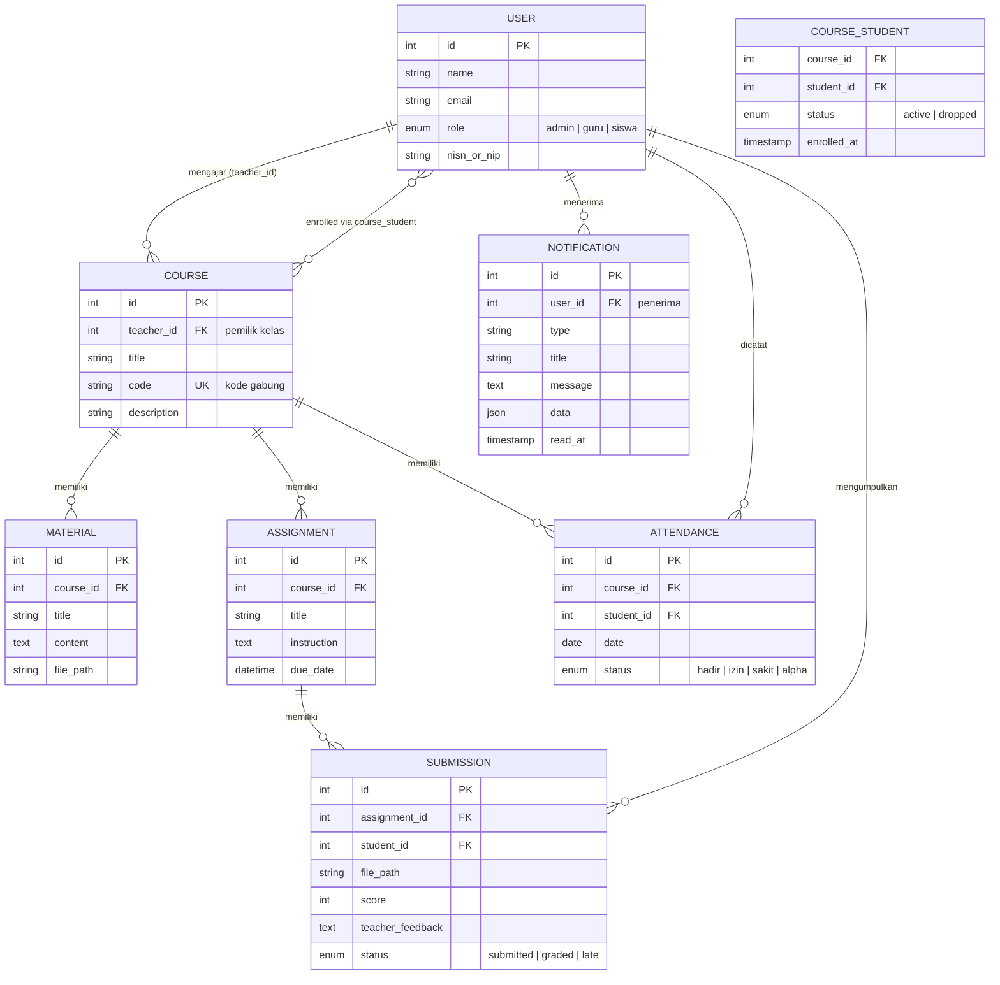
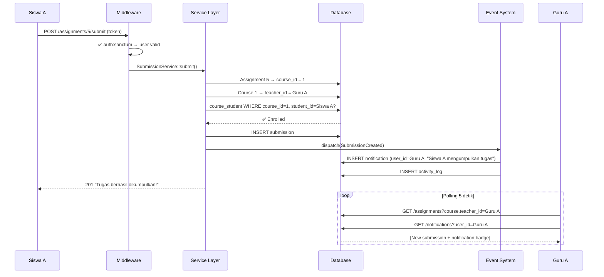

# EduSchool LMS — Enterprise Architecture Plan

> Arsitektur terinspirasi dari **Google Classroom**, **Canvas LMS**, dan **Ruangguru** — disesuaikan dengan skala project ini.

---

## Executive Summary

Project saat ini adalah **prototipe** — data di localStorage, logic di controller, tidak ada authorization, tidak ada audit. Plan ini mengubahnya menjadi **production-grade** dengan arsitektur berlapis yang scalable.

```
┌──────────────────────────────────────────────────────────────────┐
│                    ARSITEKTUR ENTERPRISE LMS                     │
│                                                                  │
│  ┌──────────────────────────────────────────────────────────┐    │
│  │                    FRONTEND (Next.js 15)                 │    │
│  │                                                          │    │
│  │  TypeScript Interfaces ── Custom Hooks ── React Context  │    │
│  │  useAuth() ── useRealtimeData() ── useCourses()         │    │
│  │  Toast System ── Skeleton Loaders ── Error Boundaries    │    │
│  └────────────────────────┬─────────────────────────────────┘    │
│                           │ REST API (Polling 5s)                │
│  ┌────────────────────────▼─────────────────────────────────┐    │
│  │                   BACKEND (Laravel 12)                   │    │
│  │                                                          │    │
│  │  Layer 1: Form Request Validation                        │    │
│  │  Layer 2: Middleware (Auth + Role) + Policy (Owner)      │    │
│  │  Layer 3: Service Layer (Business Logic)                 │    │
│  │  Layer 4: API Resource (Response Transformer)            │    │
│  │  Layer 5: Events + Listeners (Side Effects)              │    │
│  │  Layer 6: Notifications (In-App)                         │    │
│  │  Layer 7: Activity Log (Audit Trail)                     │    │
│  └────────────────────────┬─────────────────────────────────┘    │
│                           │                                      │
│  ┌────────────────────────▼─────────────────────────────────┐    │
│  │                    DATABASE (MySQL/SQLite)                │    │
│  │                                                          │    │
│  │  users ── courses ── course_student (pivot)              │    │
│  │  assignments ── submissions ── materials                 │    │
│  │  attendances ── notifications ── activity_logs           │    │
│  └──────────────────────────────────────────────────────────┘    │
└──────────────────────────────────────────────────────────────────┘
```

---

## Audit Kondisi Saat Ini vs Target Enterprise

| Aspek | Saat Ini ❌ | Target Enterprise ✅ |
|-------|-----------|---------------------|
| **Data Source** | localStorage + sebagian API | 100% dari database via API |
| **Realtime** | Manual refresh | Short polling 5 detik |
| **Isolasi Data** | Tidak ada — data bocor antar user | Course-centric isolation chain |
| **Authorization** | Route tanpa auth middleware | Middleware + Policy per resource |
| **Validation** | Inline di controller | Form Request classes |
| **Business Logic** | Campur di controller | Service Layer terpisah |
| **API Response** | Raw Eloquent model | API Resource transformer |
| **Side Effects** | Tidak ada | Event-driven (Events + Listeners) |
| **Notifications** | Tidak ada | In-app notification system |
| **Audit Trail** | Tidak ada | Activity log per aksi |
| **TypeScript** | Semua `any` | Typed interfaces |
| **Error Handling** | `catch(() => [])` | Centralized error handler |
| **Loading State** | Boolean `isLoading` | Skeleton loaders |

---

## Rantai Isolasi Data — Prinsip "Course-Centric"

> [!IMPORTANT]
> **Setiap data di LMS mengalir melalui `Course`.** Course menghubungkan Guru (pemilik) dengan Siswa (enrolled). Tidak ada data yang bisa diakses tanpa melalui rantai ini.



### Matriks Akses Data Per Role

| Data | Admin | Guru | Siswa |
|------|-------|------|-------|
| **Courses** | Semua | Hanya `teacher_id = self` | Hanya enrolled via `course_student` |
| **Assignments** | Semua | Hanya dari course miliknya | Hanya dari course enrolled |
| **Submissions** | Semua | Hanya dari assignment → course miliknya | Hanya milik sendiri (`student_id = self`) |
| **Materials** | Semua | Hanya dari course miliknya | Hanya dari course enrolled |
| **Attendances** | Semua | Hanya dari course miliknya | Hanya record sendiri |
| **Users** | Semua (CRUD) | Read-only (siswa enrolled) | Hanya profil sendiri |
| **Notifications** | Semua milik sendiri | Semua milik sendiri | Semua milik sendiri |

### Flow Contoh: Siswa Submit di Kelas yang Benar



---

## User Review Required

> [!WARNING]
> **Breaking Change: Seluruh data localStorage akan diabaikan.**
> Courses, submissions, attendance yang tersimpan di localStorage browser akan tidak dipakai lagi. Semua data murni dari database.

> [!IMPORTANT]
> **2 tabel pivot baru + 2 tabel sistem baru.**
> `course_student` (enrollment), `attendances`, `notifications`, `activity_logs` akan di-migrate. Siswa perlu join ulang kelas via database.

> [!CAUTION]
> **Semua halaman frontend akan dimodifikasi.**
> Setiap `page.tsx` akan diubah dari localStorage/hardcoded ke API-driven. Perubahan ini masif tapi tidak mengubah tampilan UI — hanya data source-nya.

---

## Open Questions

1. **Interval polling**: 5 detik (responsif, lebih banyak request) atau 10 detik (hemat resource)?
2. **Absensi model**: Guru yang membuka absensi per pertemuan, atau siswa self-attend?
3. **Notification delivery**: Hanya in-app polling, atau mau tambah browser push notification juga?

---

## Proposed Changes — 6 Fase

### Fase 1: Database Layer — Tabel Baru & Relasi Model

---

#### [NEW] `backend/database/migrations/xxxx_create_course_student_table.php`

```php
Schema::create('course_student', function (Blueprint $table) {
    $table->id();
    $table->foreignId('course_id')->constrained()->onDelete('cascade');
    $table->foreignId('student_id')->constrained('users')->onDelete('cascade');
    $table->enum('status', ['active', 'dropped'])->default('active');
    $table->timestamps();
    $table->unique(['course_id', 'student_id']);
});
```

#### [NEW] `backend/database/migrations/xxxx_create_attendances_table.php`

```php
Schema::create('attendances', function (Blueprint $table) {
    $table->id();
    $table->foreignId('course_id')->constrained()->onDelete('cascade');
    $table->foreignId('student_id')->constrained('users')->onDelete('cascade');
    $table->date('date');
    $table->enum('status', ['hadir', 'izin', 'sakit', 'alpha'])->default('hadir');
    $table->text('note')->nullable();
    $table->timestamps();
    $table->unique(['course_id', 'student_id', 'date']);
});
```

#### [NEW] `backend/database/migrations/xxxx_create_notifications_table.php`

```php
Schema::create('notifications', function (Blueprint $table) {
    $table->id();
    $table->foreignId('user_id')->constrained()->onDelete('cascade');
    $table->string('type');         // 'submission', 'grade', 'material', 'enrollment'
    $table->string('title');
    $table->text('message');
    $table->json('data')->nullable(); // metadata (course_id, assignment_id, etc.)
    $table->timestamp('read_at')->nullable();
    $table->timestamps();
    $table->index(['user_id', 'read_at']); // fast unread query
});
```

#### [NEW] `backend/database/migrations/xxxx_create_activity_logs_table.php`

```php
Schema::create('activity_logs', function (Blueprint $table) {
    $table->id();
    $table->foreignId('user_id')->constrained()->onDelete('cascade');
    $table->string('action');       // 'created', 'updated', 'deleted', 'submitted', 'graded'
    $table->string('entity_type');  // 'course', 'assignment', 'submission', etc.
    $table->unsignedBigInteger('entity_id');
    $table->json('changes')->nullable();
    $table->string('ip_address')->nullable();
    $table->timestamps();
    $table->index(['entity_type', 'entity_id']);
});
```

#### [NEW] `backend/app/Models/Attendance.php`
#### [NEW] `backend/app/Models/Notification.php`
#### [NEW] `backend/app/Models/ActivityLog.php`

#### [MODIFY] [Course.php](file:///d:/project1/Frontend1/backend/app/Models/Course.php)
Tambah relasi `students()` (belongsToMany via pivot), `attendances()` (hasMany).

#### [MODIFY] [User.php](file:///d:/project1/Frontend1/backend/app/Models/User.php)
Tambah relasi `enrolledCourses()`, `attendances()`, `notifications()`.

#### [MODIFY] [Assignment.php](file:///d:/project1/Frontend1/backend/app/Models/Assignment.php)
Tambah helper `scopeForTeacher()`, `scopeForStudent()`.

---

### Fase 2: Backend — Service Layer, Policy, Form Request

---

> [!NOTE]
> **Service Layer Pattern** — Business logic dipisah dari Controller. Controller hanya menerima request dan mengembalikan response. Semua logic ada di Service.

#### [NEW] `backend/app/Services/CourseService.php`

```php
class CourseService
{
    public function getCoursesForUser(User $user): Collection
    {
        $query = Course::with('teacher')->withCount(['materials', 'assignments', 'students']);
        
        return match($user->role) {
            'guru'  => $query->where('teacher_id', $user->id)->latest()->get(),
            'siswa' => $query->whereHas('students', fn($q) => 
                         $q->where('users.id', $user->id))->latest()->get(),
            'admin' => $query->latest()->get(),
        };
    }

    public function enrollStudent(Course $course, User $student): void
    {
        if ($student->role !== 'siswa') throw new ForbiddenException('Hanya siswa yang bisa enroll');
        if ($course->students()->where('users.id', $student->id)->exists()) {
            throw new ConflictException('Sudah terdaftar di kelas ini');
        }
        
        $course->students()->attach($student->id, ['status' => 'active']);
        
        // Dispatch event → creates notification for teacher
        event(new StudentEnrolled($course, $student));
    }

    public function enrollByCode(string $code, User $student): Course
    {
        $course = Course::where('code', $code)->firstOrFail();
        $this->enrollStudent($course, $student);
        return $course;
    }
    
    // ... more methods
}
```

#### [NEW] `backend/app/Services/SubmissionService.php`

```php
class SubmissionService
{
    public function submit(Assignment $assignment, User $student, Request $request): Submission
    {
        // Verify enrollment chain: assignment → course → student enrolled?
        $isEnrolled = $assignment->course->students()
            ->where('users.id', $student->id)->exists();
        if (!$isEnrolled) throw new ForbiddenException('Tidak terdaftar di kelas ini');
        
        // Handle file upload
        $path = $request->hasFile('file') 
            ? $request->file('file')->store('tugas', 'public') 
            : null;
        
        $isLate = $assignment->due_date && now()->greaterThan($assignment->due_date);
        
        $submission = Submission::updateOrCreate(
            ['assignment_id' => $assignment->id, 'student_id' => $student->id],
            [
                'file_path' => $path,
                'original_filename' => $request->file('file')?->getClientOriginalName(),
                'note' => $request->note,
                'status' => $isLate ? 'late' : 'submitted',
                'submitted_at' => now(),
            ]
        );
        
        // Event → notifies teacher
        event(new SubmissionCreated($submission));
        
        return $submission;
    }

    public function grade(Submission $submission, User $teacher, int $score, ?string $feedback): Submission
    {
        // Verify ownership: submission → assignment → course → teacher_id = me?
        if ($submission->assignment->course->teacher_id !== $teacher->id) {
            throw new ForbiddenException('Bukan tugas dari kelas Anda');
        }
        
        $submission->update([
            'score' => $score,
            'teacher_feedback' => $feedback,
            'status' => 'graded',
        ]);
        
        // Event → notifies student
        event(new SubmissionGraded($submission));
        
        return $submission;
    }
}
```

#### [NEW] `backend/app/Services/AttendanceService.php`

```php
class AttendanceService
{
    public function getForCourse(Course $course, User $user, ?string $date): Collection
    {
        // Only course owner (teacher) or admin can view
        if ($user->role === 'guru' && $course->teacher_id !== $user->id) {
            throw new ForbiddenException('Bukan kelas Anda');
        }
        
        $query = Attendance::where('course_id', $course->id)->with('student');
        if ($date) $query->where('date', $date);
        return $query->latest()->get();
    }

    public function saveBulk(Course $course, User $teacher, string $date, array $records): void
    {
        if ($course->teacher_id !== $teacher->id) {
            throw new ForbiddenException('Bukan kelas Anda');
        }
        
        foreach ($records as $record) {
            // Verify student is enrolled
            if (!$course->students()->where('users.id', $record['student_id'])->exists()) continue;
            
            Attendance::updateOrCreate(
                ['course_id' => $course->id, 'student_id' => $record['student_id'], 'date' => $date],
                ['status' => $record['status'], 'note' => $record['note'] ?? null]
            );
        }
        
        event(new AttendanceSaved($course, $date));
    }

    public function selfAttend(Course $course, User $student): Attendance
    {
        if (!$course->students()->where('users.id', $student->id)->exists()) {
            throw new ForbiddenException('Tidak terdaftar di kelas ini');
        }
        
        return Attendance::updateOrCreate(
            ['course_id' => $course->id, 'student_id' => $student->id, 'date' => today()],
            ['status' => 'hadir']
        );
    }
}
```

#### [NEW] `backend/app/Services/NotificationService.php`

```php
class NotificationService
{
    public function send(User $recipient, string $type, string $title, string $message, array $data = []): void
    {
        AppNotification::create([
            'user_id' => $recipient->id,
            'type' => $type,
            'title' => $title,
            'message' => $message,
            'data' => $data,
        ]);
    }
    
    public function getUnread(User $user): Collection
    {
        return AppNotification::where('user_id', $user->id)
            ->whereNull('read_at')
            ->latest()
            ->limit(20)
            ->get();
    }
    
    public function markAsRead(User $user, ?int $notificationId = null): void
    {
        $query = AppNotification::where('user_id', $user->id)->whereNull('read_at');
        if ($notificationId) $query->where('id', $notificationId);
        $query->update(['read_at' => now()]);
    }
}
```

#### [NEW] Laravel Policies — Authorization per resource

`backend/app/Policies/CoursePolicy.php`:
```php
class CoursePolicy
{
    public function view(User $user, Course $course): bool
    {
        return match($user->role) {
            'admin' => true,
            'guru' => $course->teacher_id === $user->id,
            'siswa' => $course->students()->where('users.id', $user->id)->exists(),
        };
    }

    public function update(User $user, Course $course): bool
    {
        return $user->role === 'admin' || $course->teacher_id === $user->id;
    }

    public function delete(User $user, Course $course): bool
    {
        return $user->role === 'admin' || $course->teacher_id === $user->id;
    }
}
```

`backend/app/Policies/AssignmentPolicy.php`, `SubmissionPolicy.php` — serupa, verifikasi melalui rantai course.

#### [NEW] Form Request Classes — Validation terpisah

`backend/app/Http/Requests/StoreAssignmentRequest.php`:
```php
class StoreAssignmentRequest extends FormRequest
{
    public function authorize(): bool
    {
        $course = Course::findOrFail($this->course_id);
        return $this->user()->role === 'admin' || $course->teacher_id === $this->user()->id;
    }

    public function rules(): array
    {
        return [
            'course_id' => 'required|exists:courses,id',
            'title' => 'required|string|max:255',
            'instruction' => 'nullable|string',
            'due_date' => 'nullable|date|after:now',
        ];
    }

    public function messages(): array
    {
        return [
            'course_id.required' => 'Kelas harus dipilih.',
            'title.required' => 'Judul tugas wajib diisi.',
            'due_date.after' => 'Deadline harus di masa depan.',
        ];
    }
}
```

Buat juga: `StoreCourseRequest`, `StoreSubmissionRequest`, `StoreMaterialRequest`, `StoreAttendanceRequest`.

#### [NEW] API Resources — Response transformer

`backend/app/Http/Resources/CourseResource.php`:
```php
class CourseResource extends JsonResource
{
    public function toArray(Request $request): array
    {
        return [
            'id' => $this->id,
            'title' => $this->title,
            'code' => $this->code,
            'description' => $this->description,
            'teacher' => new UserResource($this->whenLoaded('teacher')),
            'materials_count' => $this->whenCounted('materials'),
            'assignments_count' => $this->whenCounted('assignments'),
            'students_count' => $this->whenCounted('students'),
            'is_enrolled' => $this->when(
                $request->user()?->role === 'siswa',
                fn() => $this->students()->where('users.id', $request->user()->id)->exists()
            ),
            'created_at' => $this->created_at->toISOString(),
        ];
    }
}
```

Buat juga: `UserResource`, `AssignmentResource`, `SubmissionResource`, `MaterialResource`, `AttendanceResource`, `NotificationResource`.

#### [NEW] Laravel Events + Listeners — Side effects

Events:
- `SubmissionCreated` → Listener: kirim notifikasi ke guru pemilik course
- `SubmissionGraded` → Listener: kirim notifikasi ke siswa
- `StudentEnrolled` → Listener: kirim notifikasi ke guru
- `MaterialCreated` → Listener: kirim notifikasi ke semua siswa enrolled
- `AssignmentCreated` → Listener: kirim notifikasi ke semua siswa enrolled
- `AttendanceSaved` → Listener: log activity

```php
// app/Events/SubmissionCreated.php
class SubmissionCreated
{
    public function __construct(public Submission $submission) {}
}

// app/Listeners/NotifyTeacherOfSubmission.php
class NotifyTeacherOfSubmission
{
    public function handle(SubmissionCreated $event): void
    {
        $submission = $event->submission;
        $teacher = $submission->assignment->course->teacher;
        $student = $submission->student;
        
        app(NotificationService::class)->send(
            $teacher,
            'submission',
            "Tugas Baru Dikumpulkan",
            "{$student->name} mengumpulkan tugas \"{$submission->assignment->title}\"",
            ['assignment_id' => $submission->assignment_id, 'submission_id' => $submission->id]
        );
    }
}
```

#### [NEW] `backend/app/Http/Middleware/CheckRole.php`

```php
class CheckRole
{
    public function handle(Request $request, Closure $next, ...$roles): Response
    {
        if (!$request->user() || !in_array($request->user()->role, $roles)) {
            return response()->json(['message' => 'Akses ditolak untuk role Anda.'], 403);
        }
        return $next($request);
    }
}
```

---

### Fase 3: Backend — Controller Refactor & Routes

---

#### [MODIFY] [api.php](file:///d:/project1/Frontend1/backend/routes/api.php)

Semua route dilindungi auth, dikelompokkan per domain:

```php
Route::prefix('v1')->group(function () {
    Route::post('/auth/login', [AuthController::class, 'login']);

    Route::middleware('auth:sanctum')->group(function () {
        // ─── Auth ────────────────────────────────────
        Route::get('/auth/me', [AuthController::class, 'me']);
        Route::post('/auth/logout', [AuthController::class, 'logout']);
        Route::put('/auth/profile', [AuthController::class, 'updateProfile']);

        // ─── Notifications ───────────────────────────
        Route::get('/notifications', [NotificationController::class, 'index']);
        Route::get('/notifications/unread-count', [NotificationController::class, 'unreadCount']);
        Route::put('/notifications/{id}/read', [NotificationController::class, 'markAsRead']);
        Route::put('/notifications/read-all', [NotificationController::class, 'markAllAsRead']);

        // ─── Courses ─────────────────────────────────
        Route::get('/courses', [CourseController::class, 'index']);
        Route::get('/courses/available', [CourseController::class, 'available']);
        Route::post('/courses', [CourseController::class, 'store']);
        Route::get('/courses/{course}', [CourseController::class, 'show']);
        Route::put('/courses/{course}', [CourseController::class, 'update']);
        Route::delete('/courses/{course}', [CourseController::class, 'destroy']);

        // ─── Enrollment ──────────────────────────────
        Route::post('/courses/{course}/enroll', [EnrollmentController::class, 'enroll']);
        Route::post('/courses/enroll-by-code', [EnrollmentController::class, 'enrollByCode']);
        Route::post('/courses/{course}/leave', [EnrollmentController::class, 'leave']);
        Route::get('/courses/{course}/students', [EnrollmentController::class, 'students']);
        Route::delete('/courses/{course}/students/{student}', [EnrollmentController::class, 'kick']);

        // ─── Materials ───────────────────────────────
        Route::get('/materials', [MaterialController::class, 'index']);
        Route::post('/materials', [MaterialController::class, 'store']);
        Route::delete('/materials/{material}', [MaterialController::class, 'destroy']);

        // ─── Assignments ─────────────────────────────
        Route::get('/assignments', [AssignmentController::class, 'index']);
        Route::get('/assignments/{assignment}', [AssignmentController::class, 'show']);
        Route::post('/assignments', [AssignmentController::class, 'store']);
        Route::delete('/assignments/{assignment}', [AssignmentController::class, 'destroy']);

        // ─── Submissions ─────────────────────────────
        Route::post('/assignments/{assignment}/submit', [SubmissionController::class, 'submit']);
        Route::get('/submissions/my', [SubmissionController::class, 'mySubmissions']);
        Route::get('/assignments/{assignment}/submissions', [SubmissionController::class, 'forAssignment']);
        Route::put('/submissions/{submission}/grade', [SubmissionController::class, 'grade']);

        // ─── Attendance ──────────────────────────────
        Route::get('/courses/{course}/attendances', [AttendanceController::class, 'index']);
        Route::post('/courses/{course}/attendances', [AttendanceController::class, 'store']);
        Route::post('/courses/{course}/attend', [AttendanceController::class, 'selfAttend']);
        Route::get('/attendances/my', [AttendanceController::class, 'myAttendances']);

        // ─── Admin Only ──────────────────────────────
        Route::middleware('role:admin')->prefix('admin')->group(function () {
            Route::get('/stats', [AdminController::class, 'stats']);
            Route::apiResource('/users', AdminController::class);
            Route::put('/users/{user}/reset-password', [AdminController::class, 'resetPassword']);
            Route::post('/users/bulk-import', [AdminController::class, 'bulkImport']);
        });
    });
});
```

#### Controllers — Slim, delegate ke Service

Setiap controller menjadi tipis — hanya menerima request dan mengembalikan response. Contoh `CourseController`:

```php
class CourseController extends Controller
{
    public function __construct(private CourseService $service) {}

    public function index(Request $request)
    {
        $courses = $this->service->getCoursesForUser($request->user());
        return CourseResource::collection($courses);
    }

    public function store(StoreCourseRequest $request)
    {
        $course = $this->service->create($request->user(), $request->validated());
        return new CourseResource($course);
    }

    public function show(Course $course)
    {
        $this->authorize('view', $course);
        return new CourseResource($course->load(['teacher', 'materials', 'assignments']));
    }

    public function destroy(Course $course)
    {
        $this->authorize('delete', $course);
        $this->service->delete($course);
        return response()->json(['message' => 'Kelas berhasil dihapus.']);
    }
}
```

Refactor serupa untuk: `AssignmentController`, `MaterialController`, `SubmissionController`.

#### [NEW] `backend/app/Http/Controllers/Api/EnrollmentController.php`
#### [NEW] `backend/app/Http/Controllers/Api/AttendanceController.php`
#### [NEW] `backend/app/Http/Controllers/Api/NotificationController.php`

#### [MODIFY] [AdminController.php](file:///d:/project1/Frontend1/backend/app/Http/Controllers/Api/AdminController.php)
Tambah method `stats()` untuk dashboard summary:
```php
public function stats()
{
    return response()->json([
        'total_users' => User::count(),
        'teachers' => User::where('role', 'guru')->count(),
        'students' => User::where('role', 'siswa')->count(),
        'courses' => Course::count(),
        'assignments' => Assignment::count(),
        'submissions_today' => Submission::whereDate('submitted_at', today())->count(),
        'attendance_rate' => // calculate from attendances table
    ]);
}
```

---

### Fase 4: Frontend — TypeScript Types & Custom Hooks

---

#### [NEW] `Frontend/types/models.ts`

Mengganti semua `any` dengan typed interfaces:

```typescript
export interface User {
  id: number;
  name: string;
  email: string;
  role: 'admin' | 'guru' | 'siswa';
  nisn_or_nip?: string;
  subject?: string;
  phone?: string;
  bio?: string;
}

export interface Course {
  id: number;
  title: string;
  code: string;
  description?: string;
  teacher: User;
  materials_count: number;
  assignments_count: number;
  students_count: number;
  is_enrolled?: boolean;
  created_at: string;
}

export interface Assignment {
  id: number;
  course_id: number;
  title: string;
  instruction?: string;
  due_date?: string;
  course: Course;
  submissions_count: number;
}

export interface Submission {
  id: number;
  assignment_id: number;
  student_id: number;
  file_path?: string;
  original_filename?: string;
  note?: string;
  score?: number;
  teacher_feedback?: string;
  status: 'submitted' | 'graded' | 'late';
  submitted_at: string;
  student?: User;
  assignment?: Assignment;
}

export interface Material {
  id: number;
  course_id: number;
  title: string;
  content?: string;
  file_path?: string;
  course?: Course;
}

export interface Attendance {
  id: number;
  course_id: number;
  student_id: number;
  date: string;
  status: 'hadir' | 'izin' | 'sakit' | 'alpha';
  note?: string;
  course?: Course;
  student?: User;
}

export interface Notification {
  id: number;
  type: string;
  title: string;
  message: string;
  data?: Record<string, any>;
  read_at?: string;
  created_at: string;
}
```

#### [NEW] `Frontend/hooks/useRealtimeData.ts`

Generic hook untuk polling data dari API:

```typescript
export function useRealtimeData<T>(
  fetchFn: () => Promise<T>,
  intervalMs = 5000,
  deps: any[] = []
): {
  data: T | null;
  isLoading: boolean;
  error: Error | null;
  refresh: () => Promise<void>;
}
```
- Pause saat tab hidden (Page Visibility API)
- Deduplicate concurrent requests
- Optimistic update support via `refresh()`

#### [NEW] `Frontend/hooks/useAuth.ts`

```typescript
export function useAuth(): {
  user: User | null;
  isLoading: boolean;
  isAuthenticated: boolean;
  logout: () => Promise<void>;
}
```
- Validate token via `/auth/me` on mount
- Auto-redirect ke `/login` jika expired
- Cache user di state (bukan localStorage read tiap render)

#### [NEW] `Frontend/hooks/useNotifications.ts`

```typescript
export function useNotifications(): {
  notifications: Notification[];
  unreadCount: number;
  markAsRead: (id: number) => void;
  markAllAsRead: () => void;
}
```
- Polling unread count setiap 10 detik
- Badge di sidebar/navbar

#### [MODIFY] [api.ts](file:///d:/project1/Frontend1/Frontend/lib/api.ts)

Expand dengan semua endpoint baru + proper typing:

```typescript
// Enrollment
enrollCourse: (id: number) => fetchApi(`/courses/${id}/enroll`, { method: 'POST' }),
enrollByCode: (code: string) => fetchApi('/courses/enroll-by-code', { method: 'POST', ... }),
leaveCourse: (id: number) => fetchApi(`/courses/${id}/leave`, { method: 'POST' }),
getCourseStudents: (id: number) => fetchApi(`/courses/${id}/students`),
getAvailableCourses: () => fetchApi('/courses/available'),
kickStudent: (courseId: number, studentId: number) => fetchApi(`/courses/${courseId}/students/${studentId}`, { method: 'DELETE' }),

// Attendance
getCourseAttendances: (courseId: number, date?: string) => ...,
saveCourseAttendances: (courseId: number, data: object) => ...,
selfAttend: (courseId: number) => ...,
getMyAttendances: () => ...,

// Notifications
getNotifications: () => fetchApi('/notifications'),
getUnreadCount: () => fetchApi('/notifications/unread-count'),
markNotificationRead: (id: number) => ...,
markAllNotificationsRead: () => ...,

// Admin
getAdminStats: () => fetchApi('/admin/stats'),
```

#### [MODIFY] [LmsContext.tsx](file:///d:/project1/Frontend1/Frontend/context/LmsContext.tsx)

**Refactor total** — hapus semua localStorage, ganti dengan API + hooks:

```typescript
export function LmsProvider({ children }: { children: React.ReactNode }) {
  const { user } = useAuth();
  const { data: courses, refresh: refreshCourses } = useRealtimeData<Course[]>(
    () => api.getCourses(), 5000, [user?.id]
  );

  const addCourse = async (data: CreateCourseInput): Promise<Course> => {
    const result = await api.createCourse(data);
    await refreshCourses();
    return result.course;
  };

  const joinByCode = async (code: string) => {
    const result = await api.enrollByCode(code);
    await refreshCourses();
    return result;
  };
  
  // ... semua operasi via API, ZERO localStorage
}
```

---

### Fase 5: Frontend — Update Semua Halaman

---

> [!NOTE]
> **Prinsip**: Setiap halaman akan menggunakan pattern yang sama:
> 1. `useAuth()` untuk current user
> 2. `useRealtimeData()` untuk data polling
> 3. Typed interfaces (bukan `any`)
> 4. API calls untuk mutasi (create/update/delete)
> 5. Hapus semua `localStorage.getItem/setItem` untuk data

#### Admin Pages (5 file)

| File | Perubahan Utama |
|------|----------------|
| [admin/dashboard](file:///d:/project1/Frontend1/Frontend/app/admin/dashboard/page.tsx) | `useRealtimeData(() => api.getAdminStats())` — stats auto-update. Hapus manual count. |
| [admin/users](file:///d:/project1/Frontend1/Frontend/app/admin/users/page.tsx) | Tambah polling tiap 10 detik. Sudah pakai API — hanya perlu hook + types. |
| [admin/courses](file:///d:/project1/Frontend1/Frontend/app/admin/courses/page.tsx) | Hapus fallback "Budi Santoso". `students_count` dari backend `withCount`. Polling. |
| [admin/assignments](file:///d:/project1/Frontend1/Frontend/app/admin/assignments/page.tsx) | Polling. Admin lihat semua assignments. |
| [admin/reports](file:///d:/project1/Frontend1/Frontend/app/admin/reports/page.tsx) | Hapus data hardcoded. Fetch dari `api.getAdminStats()` + attendance aggregations. |

#### Guru Pages (7 file)

| File | Perubahan Utama |
|------|----------------|
| [guru/dashboard](file:///d:/project1/Frontend1/Frontend/app/guru/dashboard/page.tsx) | ❌ Hapus semua `includes('budi')`. ✅ `useRealtimeData(() => api.getCourses())` — backend filter by `teacher_id`. |
| [guru/courses](file:///d:/project1/Frontend1/Frontend/app/guru/courses/page.tsx) | ❌ Hapus filter manual by nama. ✅ `api.getCourseStudents()` untuk enrolled students (bukan semua siswa). |
| [guru/materi](file:///d:/project1/Frontend1/Frontend/app/guru/materi/page.tsx) | Sudah pakai API ✅ — tambah polling + course ownership verification. |
| [guru/tugas](file:///d:/project1/Frontend1/Frontend/app/guru/tugas/page.tsx) | ❌ Hapus `localStorage.getItem('lms_task_submissions_')`. ✅ `api.getAssignmentSubmissions()` + polling 5s. |
| [guru/absensi](file:///d:/project1/Frontend1/Frontend/app/guru/absensi/page.tsx) | ❌ Hapus `localStorage.getItem('lms_attendance_db')`. ✅ `api.getCourseAttendances()` + `api.saveCourseAttendances()`. |
| [guru/reports](file:///d:/project1/Frontend1/Frontend/app/guru/reports/page.tsx) | ❌ Hapus hardcode nama + fallback data. ✅ Scores dari `api.getAssignmentSubmissions()` aggregated per student. |
| [guru/profile](file:///d:/project1/Frontend1/Frontend/app/guru/profile/page.tsx) | ❌ Hapus localStorage cache per user. ✅ `api.updateProfile()` langsung ke backend. |

#### Siswa Pages (7 file)

| File | Perubahan Utama |
|------|----------------|
| [siswa/dashboard](file:///d:/project1/Frontend1/Frontend/app/siswa/dashboard/page.tsx) | ❌ Hapus data hardcoded stats/notifications. ✅ `api.getCourses()` count + `api.getNotifications()` + `api.getMyAttendances()` aggregation. |
| [siswa/courses](file:///d:/project1/Frontend1/Frontend/app/siswa/courses/page.tsx) | ❌ Hapus `useLms()` localStorage. ✅ "Kelas Saya" = `api.getCourses()` (backend filter enrolled). "Semua Kelas" = `api.getAvailableCourses()`. Join/leave via API. |
| [siswa/materi](file:///d:/project1/Frontend1/Frontend/app/siswa/materi/page.tsx) | ❌ Hapus **seluruh array hardcoded**. ✅ `api.getMaterials(courseId)` — backend filter by enrollment. Polling. |
| [siswa/tugas](file:///d:/project1/Frontend1/Frontend/app/siswa/tugas/page.tsx) | ❌ Hapus localStorage submission tracking. ✅ `api.getAssignments()` (filtered by enrolled courses) + `api.getMySubmissions()` untuk status. Polling 5s — grade dari guru langsung muncul. |
| [siswa/absensi](file:///d:/project1/Frontend1/Frontend/app/siswa/absensi/page.tsx) | ❌ Hapus localStorage `lms_attendance_db`. ✅ `api.selfAttend(courseId)` + `api.getMyAttendances()`. |
| [siswa/reports](file:///d:/project1/Frontend1/Frontend/app/siswa/reports/page.tsx) | ❌ Hapus data hardcoded report. ✅ `api.getMySubmissions()` aggregated per course + `api.getMyAttendances()`. |
| [siswa/profile](file:///d:/project1/Frontend1/Frontend/app/siswa/profile/page.tsx) | ❌ Hapus data hardcoded "Marcus Johnson". ✅ `useAuth()` untuk data user + `api.updateProfile()`. |

#### Shared Components (2 file)

| File | Perubahan Utama |
|------|----------------|
| [DashboardLayout.tsx](file:///d:/project1/Frontend1/Frontend/components/DashboardLayout.tsx) | Tambah notification badge (bell icon + unread count) dari `useNotifications()`. User info dari `useAuth()` bukan hardcoded. |
| [LmsContext.tsx](file:///d:/project1/Frontend1/Frontend/context/LmsContext.tsx) | Refactor total ke API-driven (zero localStorage). |

---

### Fase 6: Integration Testing & Polish

---

#### Verification Skenario (10 test cases)

| # | Skenario | Actor | Expected |
|---|----------|-------|----------|
| 1 | Guru A buat kelas → Guru B cek courses | Guru A, Guru B | Guru B TIDAK lihat kelas Guru A |
| 2 | Guru A buat tugas → Siswa enrolled lihat | Guru A, Siswa | Siswa lihat tugas dalam 5 detik |
| 3 | Siswa submit tugas → Guru pemilik kelas lihat | Siswa, Guru | Guru lihat submission dalam 5 detik + notification badge |
| 4 | Siswa submit di kelas Guru A → Guru B cek | Siswa, Guru B | Guru B TIDAK lihat submission |
| 5 | Siswa absen di Matematika → cek absensi Fisika | Siswa | Absensi TIDAK muncul di kelas lain |
| 6 | Guru grade tugas → Siswa lihat nilai | Guru, Siswa | Siswa lihat grade dalam 5 detik + notification |
| 7 | Admin lihat semua data | Admin | Lihat seluruh courses, users, submissions |
| 8 | Siswa coba submit di kelas non-enrolled | Siswa | Error 403 "Tidak terdaftar" |
| 9 | Guru coba lihat submissions kelas Guru lain | Guru | Error 403 "Bukan kelas Anda" |
| 10 | 2 browser, 2 akun berbeda | Any | Data 100% terisolasi |

#### Build Verification
```bash
cd backend && php artisan migrate && php artisan test
cd Frontend && npm run build
```

---

## Ringkasan Lengkap File yang Berubah

### Backend — New Files (12)

| File | Tipe |
|------|------|
| `migrations/create_course_student_table.php` | Migration |
| `migrations/create_attendances_table.php` | Migration |
| `migrations/create_notifications_table.php` | Migration |
| `migrations/create_activity_logs_table.php` | Migration |
| `Models/Attendance.php` | Model |
| `Models/Notification.php` | Model |
| `Models/ActivityLog.php` | Model |
| `Services/CourseService.php` | Service |
| `Services/SubmissionService.php` | Service |
| `Services/AttendanceService.php` | Service |
| `Services/NotificationService.php` | Service |
| `Middleware/CheckRole.php` | Middleware |

Plus: Policies (3), Form Requests (5), API Resources (6), Events (5), Listeners (5), Controllers baru (3) = **~27 file baru backend**

### Backend — Modified Files (6)

| File | Perubahan |
|------|-----------|
| `routes/api.php` | Protect semua route + endpoint baru |
| `Models/Course.php` | Relasi students(), attendances() |
| `Models/User.php` | Relasi enrolledCourses(), notifications() |
| `Models/Assignment.php` | Scopes forTeacher(), forStudent() |
| `Controllers/Api/AdminController.php` | Tambah stats() |
| `bootstrap/app.php` | Register middleware alias |

### Frontend — New Files (4)

| File | Tipe |
|------|------|
| `types/models.ts` | TypeScript interfaces |
| `hooks/useRealtimeData.ts` | Polling hook |
| `hooks/useAuth.ts` | Auth hook |
| `hooks/useNotifications.ts` | Notification hook |

### Frontend — Modified Files (21)

| File | Perubahan |
|------|-----------|
| `lib/api.ts` | 15+ endpoint baru |
| `context/LmsContext.tsx` | Refactor total → API |
| `components/DashboardLayout.tsx` | Notification badge + useAuth |
| `app/admin/dashboard/page.tsx` | Realtime stats |
| `app/admin/users/page.tsx` | Polling |
| `app/admin/courses/page.tsx` | Hapus hardcode, polling |
| `app/admin/assignments/page.tsx` | Polling |
| `app/admin/reports/page.tsx` | Data dari API |
| `app/guru/dashboard/page.tsx` | Hapus hardcode, polling |
| `app/guru/courses/page.tsx` | Hapus hardcode, enrolled students |
| `app/guru/tugas/page.tsx` | API submissions, polling |
| `app/guru/materi/page.tsx` | Polling |
| `app/guru/absensi/page.tsx` | API attendances |
| `app/guru/reports/page.tsx` | Data dari API |
| `app/guru/profile/page.tsx` | API profile update |
| `app/siswa/dashboard/page.tsx` | Realtime stats + notifications |
| `app/siswa/courses/page.tsx` | API enrollment |
| `app/siswa/materi/page.tsx` | Hapus hardcode, API |
| `app/siswa/tugas/page.tsx` | API submissions, polling |
| `app/siswa/absensi/page.tsx` | API attendances |
| `app/siswa/reports/page.tsx` | Data dari API |
| `app/siswa/profile/page.tsx` | API profile |

**Grand Total: ~45+ file (backend ~33, frontend ~25)**
